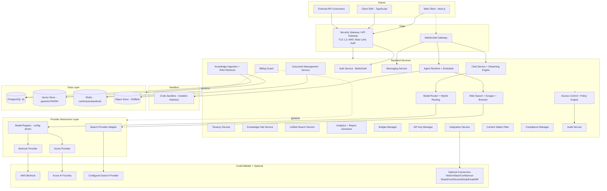
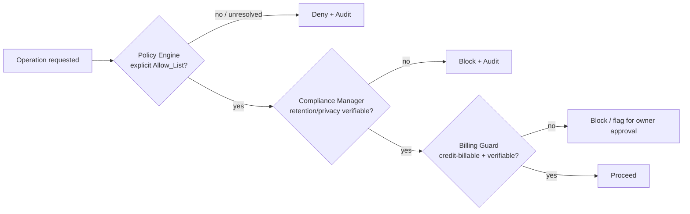
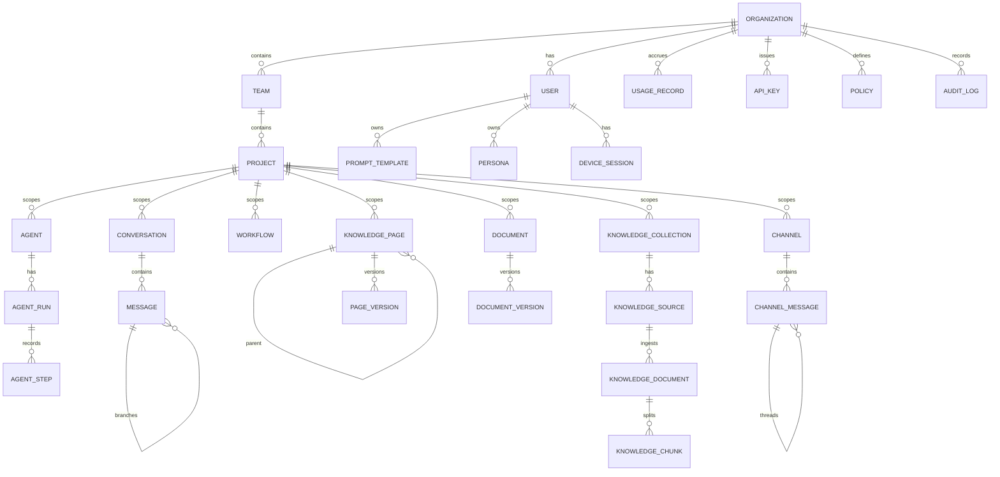

# Design Document

## Overview

Auxify AI is a complete, production-ready, multi-tenant enterprise AI SaaS platform. This document translates the 46 requirements in `requirements.md` into a concrete technical design covering architecture, services, data models, the provider abstraction and model router, RAG and knowledge, the four native enterprise modules (Knowledge Hub, Messaging, Document Management, Unified Search), the agent runtime and code sandbox, fail-closed security and compliance, observability, infrastructure, the public API/WebSocket/SDK, and the credit-only billing governance constraint.

The design is governed by a small set of cross-cutting principles that recur throughout the requirements and therefore shape every component:

- **Fail-closed by default.** Access is denied unless an explicit Allow_List grants it (Req 19), compliance-unverifiable operations are blocked (Req 38), and billing-unverifiable dependencies are blocked (Req 43). Every authorization, compliance, and billing decision defaults to deny/block.
- **Replaceable provider abstractions.** AI providers (Req 2), the search provider (Req 13), the vector backend (Req 44.3), and the code-sandbox isolation backend (Req 18.8) are all behind stable interfaces so vendors can be swapped by configuration without source redesign.
- **Native-first, connector-optional.** The platform is the system of record for knowledge, messaging, documents, and search (Req 26-29). External products (Notion, Slack, Confluence, SharePoint, Google Drive) are optional interoperability connectors only and never primary dependencies (Req 23, 30).
- **Multi-tenant isolation.** A strict Organization → Team → Project hierarchy scopes all data and access; no query crosses an Organization boundary (Req 1).
- **Environment parity.** The same architecture runs locally and deploys to a single region or multiple regions with no architectural change (Req 42).
- **Credit-only spend.** Every billable dependency is paid through AWS or Azure credits, enforced by a Billing_Guard (Req 43).

### Technology Stack

The stack is selected so that every billable runtime dependency is available on AWS (AWS credits) or Azure (Azure credits), satisfying Req 43.

| Layer              | Technology                                                            | Rationale                                                              |
| ------------------ | --------------------------------------------------------------------- | ---------------------------------------------------------------------- |
| Monorepo           | pnpm workspaces + Turborepo, shared TypeScript packages               | Single source of shared types across frontend, backend, SDK (Req 46.8) |
| Web client         | Next.js (App Router), React, Tailwind, Radix UI                       | Modern enterprise SaaS UX, theming, accessibility (Req 40, 41)         |
| Backend services   | Node.js 22 + TypeScript, NestJS-style modular services                | Strong typing reused with SDK; clean module boundaries                 |
| API gateway        | AWS ALB + application gateway service (Kong-compatible)               | TLS termination, auth, rate limiting, routing (Req 34)                 |
| Sync transport     | REST/JSON (public) + gRPC (internal)                                  | Versioned public API (Req 45), efficient internal calls                |
| Async transport    | BullMQ over Redis                                                     | Background ingestion, scheduled workflows (Req 17, 23)                 |
| Real-time          | WebSocket (Socket.IO) + SSE                                           | Streaming chat and event delivery (Req 4, 45)                          |
| Auth               | BetterAuth                                                            | Mandated primary auth framework (Req 33)                               |
| Primary DB         | PostgreSQL 16 (AWS RDS / Azure Database for PostgreSQL)               | System of record (Req 44)                                              |
| Vector store       | pgvector with HNSW behind a VectorStore interface                     | 1536-dim embeddings, migratable backend (Req 44.2, 44.3)               |
| Cache/queue        | Redis (AWS ElastiCache / Azure Cache for Redis)                       | Cache, sessions, queues, pub/sub (Req 44.4)                            |
| Object store       | S3 (AWS) / Blob Storage (Azure) behind an ObjectStore interface       | Files, documents, assets, backups (Req 44.5)                           |
| AI providers       | AWS Bedrock (Anthropic), Azure AI Foundry (OpenAI)                    | Credit-billable model access (Req 2, 43)                               |
| Browser automation | Playwright (headless Chromium)                                        | JS rendering, interactive browsing (Req 14)                            |
| Code sandbox       | Containerized runners (gVisor-hardened) behind an Isolation interface | Safe code execution, replaceable isolation (Req 18)                    |
| IaC                | Terraform modules per environment                                     | Reproducible, multi-region capable infra (Req 42)                      |
| Observability      | OpenTelemetry → CloudWatch / Azure Monitor + Prometheus/Grafana       | Metrics, logs, traces, alerts (Req 42)                                 |

### Requirements Coverage Map

| Domain                   | Requirements             | Primary components                                                                                                                       |
| ------------------------ | ------------------------ | ---------------------------------------------------------------------------------------------------------------------------------------- |
| Tenancy & RBAC           | 1, 19, 20                | Tenancy_Service, Access_Control, Policy_Engine                                                                                           |
| Provider & routing       | 2, 3                     | Provider_Abstraction_Layer, Model_Registry, Model_Router, Hybrid_Routing_Layer                                                           |
| Chat experience          | 4, 5, 6, 7, 8, 9, 10, 12 | Chat_Service, Streaming_Engine, Conversation_Manager, Input_Processor, Output_Renderer, Persona_Manager, Prompt_Library, Artifact_Editor |
| Files & RAG              | 11, 23, 24, 25           | File_Processor, Knowledge_Ingestion_Service, RAG_Retriever, Knowledge_Manager                                                            |
| Web intelligence         | 13, 14                   | Web_Search_Engine, Search_Provider_Adapter, Web_Scraper, Browser_Automation, Cache_Manager                                               |
| Agents                   | 15, 16, 17, 18           | Agent_Runtime, Tool_Registry, Code_Sandbox, Scheduler                                                                                    |
| Native modules           | 26, 27, 28, 29           | Knowledge_Hub_Service, Messaging_Service, Document_Management_Service, Unified_Search_Service                                            |
| Integrations             | 30                       | Integration_Service                                                                                                                      |
| Keys, budgets, analytics | 21, 22, 31, 32           | API_Key_Manager, Budget_Manager, Analytics_Service, Report_Generator                                                                     |
| Security & compliance    | 33, 34, 35, 36, 37, 38   | Auth_Service, Device_Manager, Security_Gateway, Content_Safety_Filter, Audit_Service, Compliance_Manager                                 |
| Reliability & infra      | 39, 42, 46               | Backup_Service, Monitoring_Service, Infrastructure_Provisioner, CI_CD_Pipeline                                                           |
| Data & API               | 44, 45                   | Primary_Database, Vector_Store, Cache_Store, Object_Store, REST_API, WebSocket_Gateway, Client_SDK                                       |
| Governance               | 43                       | Billing_Guard                                                                                                                            |

## Architecture

### System Context

Auxify AI is delivered as a horizontally scalable set of backend services fronted by an API gateway, with a Next.js web client and a TypeScript SDK as clients. All clients reach the platform exclusively through the Security_Gateway/API_Gateway, which authenticates before routing (Req 34.2). The platform integrates outward only to credit-billable dependencies (Bedrock, Azure AI Foundry, the configured search provider) and to optional connectors that never gate core operation.



### Layered Architecture

The platform is organized into clear layers so that transport, business logic, provider integration, and persistence evolve independently:

1. **Edge layer** — Security_Gateway and API_Gateway handle TLS 1.3, WAF, per-user/per-key/per-IP rate limiting, authentication, input validation, and CSRF before any request reaches business logic (Req 34). The WebSocket_Gateway authenticates connections with JWT and multiplexes event streams (Req 45.4, 45.5).
2. **Application/service layer** — Modular backend services own domain logic. Each service is stateless and horizontally scalable, exposes health/readiness endpoints (Req 39.8, 46.6), and emits structured logs with correlation IDs (Req 46.7).
3. **Provider abstraction layer** — A configuration-driven boundary for AI providers (Req 2), the search provider (Req 13), the vector backend (Req 44.3), and the sandbox isolation backend (Req 18.8). Adapters are registered from configuration, never hardcoded.
4. **Data layer** — PostgreSQL 16 (system of record), pgvector (embeddings), Redis (cache/queue/pub-sub/sessions), and an object store (files/documents/assets/backups), each behind a repository or storage interface.

### Request Flow: Streaming Chat with RAG

```mermaid
sequenceDiagram
    participant U as Client
    participant SG as Security Gateway
    participant CH as Chat Service
    participant SF as Content Safety Filter
    participant RR as RAG Retriever
    participant RT as Model Router
    participant PR as Provider (Bedrock/Azure)
    participant SE as Streaming Engine
    participant BM as Budget Manager
    participant AN as Analytics

    U->>SG: POST /v1/chat (JWT/API key)
    SG->>SG: Authenticate, rate-limit, validate, CSRF
    SG->>CH: Routed request
    CH->>BM: Check user/project/team/org budget
    BM-->>CH: Allowed (or block if cap reached)
    CH->>SF: Screen input (injection, PII mask)
    SF-->>CH: Sanitized input
    CH->>RR: Retrieve (if knowledge enabled)
    RR->>RR: Hybrid search + re-rank + permission filter + attribution
    RR-->>CH: Top-K attributed chunks (or "none found")
    CH->>RT: Route (specified model or Auto Mode)
    RT->>RT: Authorize model vs Allow_List; pick model
    RT->>PR: chat(stream=true)
    loop tokens
        PR-->>SE: token
        SE-->>U: SSE/WS token event
    end
    PR-->>SE: final usage
    SE->>SF: Scan output for PII
    SE-->>U: completion event (model, tokens, cost)
    CH->>AN: Record model/tokens/cost/latency
    CH->>BM: Attribute cost up hierarchy
```

### Multi-Tenancy Model

Every persisted, user-facing resource carries an `organization_id`, and where applicable `team_id` and `project_id` (Req 1.2). Tenant isolation is enforced at three layers in depth:

- **Application scoping** — A `TenantContext` derived from the authenticated principal is required by every repository call; queries automatically inject `organization_id` predicates.
- **Database enforcement** — PostgreSQL Row-Level Security (RLS) policies bind every tenant-scoped table to the session's `organization_id`, so a query issued in one Organization's context cannot return another Organization's rows (Req 1.4).
- **Access checks** — Access_Control verifies membership of the owning Organization/Team/Project before returning a resource (Req 1.3) and denies + audits cross-tenant references (Req 1.7).

### Fail-Closed Decision Pipeline

Three independent guards default to deny/block and are consulted on every relevant operation:



- **Policy_Engine** resolves Organization > Team > User precedence and denies when no Allow_List grants the permission or no policy resolves (Req 19.2, 19.3, 19.8).
- **Compliance_Manager** blocks any operation whose retention/privacy compliance cannot be verified (Req 38.6).
- **Billing_Guard** blocks adoption of any dependency whose credit-billing compliance cannot be verified, flagging it for explicit owner approval (Req 43.4, 43.5).

### Deployment Topology

The same service composition runs in all environments (Req 42.2). Locally, services run via Docker Compose with Postgres+pgvector, Redis, and a MinIO/S3-compatible object store. In cloud environments, Terraform modules provision the managed equivalents across multiple availability zones with no single point of failure (Req 39.5), an auto-scaling group/replica set per service (Req 39.6, 46.3), health-check-based traffic draining and instance replacement (Req 39.7), and blue-green production deploys with automatic rollback (Req 42.6, 42.7). Infrastructure is multi-region capable: region-specific state, data-residency-aware storage (Req 35.5), and stateless services allow adding regions without redesign (Req 42.3).

## Components and Interfaces

This section defines each component's responsibility and the key interfaces it exposes. Interfaces are expressed in TypeScript to match the monorepo's shared-type strategy (Req 46.8). Types referenced here are defined in the Data Models section.

### Provider Abstraction Layer

The Provider_Abstraction_Layer is the single boundary through which all AI model traffic flows. It is configuration-driven: onboarding a new provider or model is done by editing the Model_Registry configuration, never by changing source code (Req 2.2).

```typescript
interface AIProvider {
  readonly providerId: string;
  chat(req: ChatRequest): AsyncIterable<ChatChunk>;
  embed(req: EmbedRequest): Promise<EmbedResponse>; // 1536-dim
  generateImage(req: ImageRequest): Promise<ImageResponse>;
  realtime(req: RealtimeRequest): RealtimeSession;
  listModels(): Promise<ModelInfo[]>;
  healthCheck(): Promise<HealthStatus>;
}

// Adapters implement the same interface (Req 2.1)
class BedrockProvider implements AIProvider {} // Claude Opus/Sonnet/Haiku via AWS Bedrock (Req 2.4)
class AzureProvider implements AIProvider {} // GPT chat/reasoning/realtime/image via Azure AI Foundry (Req 2.5)

interface ModelRegistry {
  load(config: RegistryConfig): void; // config-driven onboarding (Req 2.2)
  get(modelId: string): ModelInfo;
  list(): ModelInfo[]; // returns modality, tier, costs, capabilities (Req 2.7)
  markUnavailable(modelId: string): void; // on failed health check (Req 2.10)
  markAvailable(modelId: string): void;
}
```

- `ModelInfo` records provider, model identifier, modality, max token limit, vision support, tool support, reasoning support, cost per 1k input tokens, cost per 1k output tokens, and tier (Req 2.6).
- At launch the registry includes all GPT-family chat models, OpenAI reasoning models, realtime models, image-generation models, and Claude Opus/Sonnet/Haiku families (Req 2.3).
- Vision-capable models accept image attachments; image-capable models accept image-generation requests and return image assets (Req 2.8, 2.9).
- A periodic health checker calls `healthCheck()` per provider; on failure, affected models are marked unavailable until a later check succeeds (Req 2.10).

### Model Router and Hybrid Routing Layer

```typescript
interface ModelRouter {
  route(req: RoutedChatRequest, principal: Principal): Promise<RouteDecision>;
  recordOutcome(outcome: RequestOutcome): void; // model, latency ms, in/out tokens, cost (Req 3.9)
}

interface HybridRoutingLayer {
  // Combines rules, governance policies, query heuristics, model-based classification (Req 3.3)
  classify(req: RoutedChatRequest): Promise<QueryClass>; // 'simple' | 'complex_reasoning' | 'code' | 'vision'
  selectModel(klass: QueryClass, allowed: ModelInfo[]): ModelInfo;
}
```

Routing behavior:

- Explicit model + permitted → route to it (Req 3.1); explicit model + not permitted → authorization error naming the disallowed model (Req 3.2).
- Auto Mode classifies the query and maps: simple → Economy, complex reasoning → Premium, code → Standard (Req 3.4), restricted to the user's permitted models (Req 3.5). Image input → vision-capable model (Req 3.6).
- On provider error/timeout, retry the next model in the Fallback Chain (Req 3.7); if all fail, return an error listing each attempted model and its failure reason (Req 3.8).
- Mid-conversation model switch applies to subsequent messages while preserving prior history (Req 3.10).

### Chat Service and Streaming Engine

```typescript
interface ChatService {
  send(req: ChatSendRequest, principal: Principal): AsyncIterable<ChatEvent>;
  switchModel(conversationId: string, modelId: string): Promise<void>; // Req 3.10
  editMessage(messageId: string, content: string): Promise<Branch>; // Req 6.1
  branch(messageId: string): Promise<Branch>; // Req 6.2
  regenerate(messageId: string, modelId: string): Promise<Message>; // Req 6.3
  compare(prompt: PromptInput, modelIds: string[]): Promise<Message[]>; // Req 6.4
  rate(messageId: string, rating: 'up' | 'neutral' | 'down'): Promise<void>; // Req 6.5
  generateTitle(conversationId: string): Promise<string>; // Req 5.8
}

interface StreamingEngine {
  stream(source: AsyncIterable<ProviderChunk>, sink: EventSink): Promise<StreamResult>;
}
```

- Tokens are transmitted incrementally over SSE or WebSocket as the model emits them, before completion (Req 4.1, 4.2). A completion event carries model, total token counts, and total cost (Req 4.3).
- On user cancel, transmission stops and the partial response is persisted (Req 4.4). On client disconnect, tokens generated before the drop are persisted (Req 4.5).
- Time-to-first-token p95 ≤ 2s under the standard load profile (Req 4.6, 46.1).
- Editing forks a new branch preserving the original thread; branching creates a child referencing the parent message; regeneration retains prior responses; comparison fans the prompt to each model for side-by-side display (Req 6.1-6.4).

### Conversation Manager

```typescript
interface ConversationManager {
  create(input: ConversationCreate, principal: Principal): Promise<Conversation>; // owner, project, ts, title (Req 5.1)
  list(principal: Principal): Promise<ConversationGroup[]>; // recent-first, grouped by date (Req 5.2)
  rename(id: string, title: string): Promise<void>; // audited (Req 5.3)
  archive(id: string): Promise<void>; // audited (Req 5.3)
  delete(id: string): Promise<void>; // audited (Req 5.3)
  assignFolder(id: string, folderId: string): Promise<void>; // Req 5.4
  search(query: string, principal: Principal): Promise<SearchHit[]>; // authorized scope, ranked (Req 5.5)
  createShareLink(id: string, mode: 'read' | 'collab'): Promise<ShareToken>; // Req 5.6
  export(id: string, fmt: 'md' | 'pdf' | 'json' | 'html'): Promise<ExportArtifact>; // Req 5.7
  pin(messageId: string): Promise<void>; // Req 6.6
}
```

### Input Processor and Output Renderer

```typescript
interface InputProcessor {
  attachFile(messageId: string, file: UploadedFile): Promise<Attachment>; // image/PDF/CSV/spreadsheet/code (Req 7.1)
  transcribeVoice(audio: AudioInput): Promise<string>; // Req 7.2
  attachPastedImage(messageId: string, image: Blob): Promise<Attachment>; // Req 7.3
  attachDropped(messageId: string, dropped: DroppedContent): Promise<Attachment>; // Req 7.4
  previewUrl(url: string): Promise<UrlPreview>; // fetch + summarize (Req 7.5)
  resolveMention(token: string): Promise<MentionTarget>; // member/doc/page/project (Req 7.6)
}
// File >100MB rejected with size-limit error (Req 7.7); >10 attachments rejected with count error (Req 7.8)

interface OutputRenderer {
  render(block: ContentBlock): RenderedBlock; // GFM, code+copy, Mermaid, LaTeX, sortable tables, artifacts (Req 8.1-8.6)
  // On block render failure, show raw content for that block and continue rendering the rest (Req 8.7)
}
```

### Persona Manager and Prompt Library

```typescript
interface PersonaManager {
  getDefault(): Persona; // Req 9.1
  listPredefined(): Persona[]; // engineering/sales/product/marketing (Req 9.2)
  apply(conversationId: string, personaId: string): Promise<void>; // Req 9.3
  createCustom(input: PersonaInput, ownerId: string): Promise<Persona>; // Req 9.4
  substituteVariables(prompt: string, vars: Record<string, string>): string; // Req 9.5
}

interface PromptLibrary {
  create(input: PromptTemplateInput, ownerId: string): Promise<PromptTemplate>; // title/content/category/tags/owner (Req 10.1)
  setVisibility(id: string, v: 'public' | 'personal'): Promise<void>; // Req 10.2, 10.3
  fillVariables(id: string, vars: Record<string, string>): Promise<string>; // Req 10.4
  edit(id: string, content: string): Promise<PromptTemplate>; // version++ , retain prior (Req 10.5)
  recordUse(id: string): Promise<void>; // usage count++ (Req 10.6)
  analytics(scope: OrgScope): Promise<PromptAnalytics>; // most-used/highest-rated/most-shared (Req 10.7)
}
```

### Artifact Editor

```typescript
interface ArtifactEditor {
  open(content: ArtifactContent): ArtifactSession; // editable side panel (Req 12.1)
  // supports code/markdown/mermaid/react/svg/csv/html (Req 12.2)
  applySectionEdit(id: string, section: SectionRef, instruction: string): Promise<Artifact>; // Req 12.3
  // every edit creates a new version, retaining history (Req 12.4)
  export(id: string): Promise<{ file: DownloadRef; clipboard: string }>; // Req 12.5
  share(id: string, members: string[]): Promise<void>; // Req 12.6
}
```

### Web Search Engine, Scraper, and Browser Automation

The Web_Search_Engine performs every search through a configuration-selected Search_Provider_Adapter and contains no hardcoded provider reference (Req 13.1). Changing the configured provider reroutes subsequent searches without source changes (Req 13.2).

```typescript
interface SearchProviderAdapter {
  readonly providerId: string;
  search(req: SearchRequest): Promise<SearchResult[]>; // ranked by relevance (Req 13.3)
  isAvailable(): Promise<boolean>;
}

interface WebSearchEngine {
  search(req: SearchRequest, principal: Principal): Promise<SearchResult[]>;
  // search types: general | news | academic | code | images (Req 13.4)
  // applies time_range (Req 13.5) and include/exclude domains (Req 13.6)
  // dedup window served from cache (Req 13.8); adapter unavailable → provider-unavailable error (Req 13.9)
}

interface WebScraper {
  scrape(req: ScrapeRequest): Promise<ScrapedContent>; // boilerplate-stripped Markdown (Req 14.1)
  // render_js → headless browser first (Req 14.2)
  // extract modes: full_text | main_content | tables | links | metadata (Req 14.3)
  // screenshot capture (Req 14.4); robots.txt evaluated and disallowed paths skipped (Req 14.5)
  // per-domain rate limit enforced (Req 14.6); success cached for retention period (Req 14.8)
}

interface BrowserAutomation {
  run(url: string, actions: BrowseAction[]): Promise<BrowseResult>; // click/type/scroll/screenshot/extract (Req 14.7)
}

interface CacheManager {
  getSearch(key: SearchKey): Promise<SearchResult[] | null>; // dedup window (Req 13.8)
  putSearch(key: SearchKey, results: SearchResult[], ttl: number): Promise<void>;
  putScrape(url: string, content: ScrapedContent, ttl: number): Promise<void>; // Req 14.8
}
```

The search billing flows through an adapter whose provider is credit-billable (Req 43.2); the Billing_Guard verifies this before the adapter is enabled.

### Agent Runtime, Tool Registry, Scheduler, and Code Sandbox

```typescript
interface AgentRuntime {
  start(run: AgentRunInput, principal: Principal): AsyncIterable<AgentStepEvent>; // plan→act→observe→iterate (Req 15.1)
  cancel(runId: string): Promise<void>; // report cancelled (Req 15.8)
  approve(runId: string, stepId: string): Promise<void>; // human-in-the-loop for destructive (Req 15.5)
}

interface ToolRegistry {
  register(tool: ToolDefinition): void; // web/data/code/communication/document/integration categories (Req 16.1)
  validateInput(toolId: string, input: unknown): ValidationResult; // schema validation (Req 16.2)
  isAllowed(toolId: string, allowList: string[]): boolean; // Allow_List enforcement (Req 16.3)
}

interface CodeSandbox {
  execute(req: SandboxExecRequest): Promise<SandboxResult>; // isolated, no network by default (Req 18.1)
  // runtimes: Python 3.12, Node 22, shell, read-only SQL on staging (Req 18.2)
  // 30s timeout → timeout result (Req 18.3); 512MB → memory-limit result (Req 18.4)
  // no fs persistence, non-root (Req 18.5); non-allow-listed import → unauthorized-package error (Req 18.6)
  // returns stdout/stderr/files/metadata{elapsedMs,memoryUsed} (Req 18.7)
}

interface SandboxIsolationBackend {
  // replaceable isolation backend; submission contract unchanged (Req 18.8)
  run(spec: ContainerSpec): Promise<ContainerResult>;
}

interface Scheduler {
  schedule(workflow: WorkflowDef, cadence: Cadence): Promise<void>; // trigger at cadence (Req 17.1)
}
```

Agent safety limits are enforced by the runtime: stop and report at 50 steps (Req 15.2), at 10 minutes (Req 15.3), and at the budget cap (Req 15.4). Each step records step number, tool used, tool input, tool output, and duration (Req 15.6); steps are emitted to the client in real time (Req 15.7). On finish, the run records final status, total steps, total tokens, total cost, and total duration (Req 15.9). Tool invocations are schema-validated (Req 16.2) and denied + recorded in run steps if not on the agent's Allow_List (Req 16.3). Pre-built templates (Research, Competitive Intel, Code Review, Content Writer, Lead Research, Report Generator, Bug Triage) are provided (Req 16.4); creating an agent from a template copies the template's system prompt, allowed tools, model, and safety limits (Req 16.5).

For scheduled workflows: steps execute in defined order, passing each step's output to referencing steps (Req 17.2); delivery-action steps deliver through the configured channel (Req 17.3); a failed step halts the workflow and records the failed step and error (Req 17.4); completion records outcome and resource usage in Analytics (Req 17.5).

### Knowledge Ingestion, RAG Retriever, and Knowledge Manager

```typescript
interface KnowledgeIngestionService {
  connectSource(src: SourceConfig): Promise<Source>;
  // native sources: upload, Knowledge Hub pages, DMS documents, messaging content, GitHub, email, web URL (Req 23.1)
  // optional connectors: Notion/Confluence/Drive/SharePoint (Req 23.2)
  ingest(sourceId: string): Promise<IngestReport>; // parse→chunk→embed→index (Req 23.3)
  detectChanges(sourceId: string): Promise<ChangeSet>; // content-hash; re-index changed only (Req 23.4)
  onChangeNotification(sourceId: string): Promise<void>; // real-time sync (Req 23.5)
  reindex(sourceId: string): Promise<IngestReport>; // scheduled (Req 23.6) or manual (Req 23.7)
}

interface RAGRetriever {
  retrieve(query: string, principal: Principal, opts: RetrieveOpts): Promise<RetrievedContext>;
  // embed query + hybrid (vector + keyword) (Req 24.1); re-rank + top-K (Req 24.2)
  // exclude chunks the user cannot access (Req 24.3)
  // attach complete attribution: source id, title, location, link (Req 24.4)
  // exclude chunk lacking complete attribution (Req 24.6)
  // below threshold → no context + "no relevant knowledge found" (Req 24.7)
}

interface KnowledgeManager {
  createCollection(input: CollectionInput): Promise<Collection>; // name/owner/source config/access list (Req 25.1)
  setAccess(collectionId: string, teams: string[], projects: string[]): Promise<void>; // restrict retrieval (Req 25.2)
  sourceStatus(collectionId: string): Promise<SourceStatus[]>; // sync status/last sync/doc count (Req 25.3)
  flagDuplicates(collectionId: string): Promise<Duplicate[]>; // Req 25.4
  markStale(collectionId: string): Promise<void>; // freshness window (Req 25.5)
}
```

Ingestion is resilient: a failed document is recorded and the remaining documents continue (Req 23.8), and if an optional external connector is unavailable, native sources continue serving uninterrupted (Req 23.9). Retrieved attribution is surfaced to the user by the Output_Renderer (Req 24.5).

### Native Module Services

```typescript
interface KnowledgeHubService {
  createPage(input: PageInput): Promise<Page>; // title/content/author/project/ts (Req 26.1)
  setParent(pageId: string, parentId: string): Promise<void>; // hierarchy + nav tree (Req 26.2)
  edit(pageId: string, content: RichContent): Promise<PageVersion>; // version + retain (Req 26.3)
  restoreVersion(pageId: string, versionId: string): Promise<PageVersion>; // Req 26.4
  comment(pageId: string, c: CommentInput): Promise<Comment>; // anchor + notify subscribers (Req 26.5)
  setPermissions(pageId: string, perms: PagePermissions): Promise<void>; // enforced via Access_Control (Req 26.6)
  aiAuthor(pageId: string, instruction: string): Promise<DraftResult>; // via Chat_Service; accept/reject (Req 26.7)
  // create/update triggers ingestion for RAG + Unified Search (Req 26.8)
  // edit without permission denied + audited (Req 26.9)
}

interface MessagingService {
  createChannel(input: ChannelInput): Promise<Channel>; // name/owner/visibility/members (Req 27.1)
  post(target: MsgTarget, msg: MessageInput): Promise<ChannelMessage>; // persist + realtime deliver (Req 27.2)
  reply(parentId: string, msg: MessageInput): Promise<ChannelMessage>; // thread order (Req 27.3)
  notifyInactive(messageId: string): Promise<void>; // notification for inactive recipients (Req 27.4)
  shareFile(target: MsgTarget, file: UploadedFile): Promise<ChannelMessage>; // stored via DMS (Req 27.5)
  search(query: string, principal: Principal): Promise<ChannelMessage[]>; // authorized + ranked (Req 27.6)
  aiAssist(conversationId: string, prompt: string): Promise<ChannelMessage>; // via Chat_Service (Req 27.7)
  // private channels restricted via Access_Control (Req 27.8); content indexed for Unified Search (Req 27.9)
}

interface DocumentManagementService {
  upload(input: DocumentInput): Promise<Document>; // store in Object_Store + metadata (Req 28.1)
  organize(docId: string, folderId: string): Promise<void>; // folder hierarchy (Req 28.2)
  addVersion(docId: string, file: UploadedFile): Promise<DocumentVersion>; // retain prior (Req 28.3)
  setPermissions(target: DocTarget, perms: DocPermissions): Promise<void>; // enforced via Access_Control (Req 28.4)
  // store/update triggers ingestion for RAG + Unified Search (Req 28.5)
  // retention end → Compliance_Manager deletes/archives + audits (Req 28.6)
  recover(docId: string): Promise<Document>; // restore from Backup_Service in window (Req 28.7)
  // access denied for unauthorized + audited (Req 28.8)
}

interface UnifiedSearchService {
  search(query: string, principal: Principal, filter?: ContentTypeFilter): Promise<GroupedResults>;
  // across conversations, messages, documents, pages, workflows, agents, reports, files, messaging (Req 29.1)
  // authorized-only (Req 29.2); grouped by type, ranked within group (Req 29.3)
  // content-type filter (Req 29.4); selecting a result returns its source-module location (Req 29.5)
  // combines keyword + vector similarity (Req 29.6)
  // unavailable source → partial results + indicate unsearched types (Req 29.7)
}
```

### Integration Service

```typescript
interface IntegrationService {
  // GitHub, email, enterprise IdP as supported integrations (Req 30.1)
  enableConnector(org: string, connector: ConnectorType): Promise<Connector>; // optional interoperability (Req 30.2)
  status(org: string): Promise<ConnectorStatus[]>; // report status (Req 30.4)
  storeCredentials(connector: string, creds: Secret): Promise<void>; // secret store; excluded from logs/UI (Req 30.5)
}
```

The platform delivers chat, knowledge, messaging, documents, and search through native modules with no required external connector (Req 30.3); if a connector or supported integration is unavailable, native modules continue uninterrupted and the connector status is reported (Req 30.4).

### Access Control, Policy Engine, and Tenancy

```typescript
type Role = 'super_admin' | 'admin' | 'power_user' | 'standard_user' | 'viewer'; // Req 19.1

interface PolicyEngine {
  // Org policies override Team policies override User policies (Req 19.3)
  evaluate(principal: Principal, action: Action, resource: ResourceRef): PolicyDecision;
  // default-deny: no Allow_List grant or unresolved → deny (Req 19.2, 19.8)
}

interface AccessControl {
  authorize(principal: Principal, action: Action, resource: ResourceRef): AuthzResult;
  // deny + audit when no Allow_List grants (Req 19.4); cross-tenant ref denied + audited (Req 1.7)
  // Premium models require explicit Premium authorization (Req 19.5)
  // viewer restricted to Economy models, shared conversations, shared prompts (Req 19.6)
}

interface TenancyService {
  createTeam(orgId: string, input: TeamInput): Promise<Team>; // name + budget (Req 20.1)
  createProject(teamId: string, input: ProjectInput): Promise<Project>; // name/access list/budget (Req 20.2)
  inviteUser(orgId: string, email: string, roles: Role[]): Promise<Invitation>; // create on accept (Req 20.3)
  assignUser(userId: string, target: TeamOrProject): Promise<void>; // Req 20.4
  deactivateUser(userId: string): Promise<void>; // revoke sessions + block auth (Req 20.5)
  setAllowedModels(userId: string, modelIds: string[]): Promise<void>; // Allow_List (Req 20.6)
  moveProject(projectId: string, newTeamId: string): Promise<void>; // reassign + audit (Req 1.6)
  applyRoleChange(userId: string, role: Role): Promise<void>; // applies to subsequent requests (Req 19.7)
}
```

### API Key Manager and Budget Manager

```typescript
interface APIKeyManager {
  create(input: KeyInput): Promise<{ plaintext: string }>; // plaintext once; store hash only (Req 21.1, 35.4)
  list(scope: KeyScope): Promise<MaskedKey[]>; // masked, prefix only (Req 21.2)
  authenticate(presented: string): Promise<KeyAuthResult>; // active + unexpired only (Req 21.3, 21.4)
  revoke(keyId: string): Promise<void>; // immediate rejection (Req 21.5)
  rotateProviderCredentials(orgId: string): Promise<void>; // >= every 90 days (Req 21.6)
  recordUse(keyId: string): Promise<void>; // timestamp + enforce rate limit (Req 21.7)
}

interface BudgetManager {
  attribute(cost: Cost, ctx: CostContext): Promise<void>; // to user/project/team/org (Req 22.1)
  checkThresholds(scope: BudgetScope): Promise<void>; // notify admin on alert threshold (Req 22.2)
  enforce(principal: Principal, req: BillableRequest): BudgetDecision;
  // user cap reached → block until reset (Req 22.3)
  // team cap reached → restrict team to Economy models until reset (Req 22.4)
  // per-model daily message limit exceeded → reject for the day (Req 22.5)
  // usage records retained 2 years (Req 22.6)
}
```

### Auth Service, Device Manager, Security Gateway, Content Safety Filter

```typescript
interface AuthService {
  // built on BetterAuth (Req 33.1)
  signInPassword(email: string, password: string): Promise<Session>; // Req 33.2
  signInOAuth(provider: string, code: string): Promise<Session>; // OAuth/OIDC (Req 33.3)
  signInSSO(samlResponse: string): Promise<Session>; // SAML 2.0 (Req 33.4)
  requireMfa(principal: Principal): boolean; // enabled per user, privileged roles, or org policy (Req 33.5-33.7)
  issueTokens(session: Session): { access: string; refresh: string }; // short-lived + refresh (Req 33.8)
  refresh(refreshToken: string): { access: string }; // Req 33.9
  signOut(sessionId: string): Promise<void>; // invalidate tokens (Req 33.13)
  // failed auth → deny + audit (Req 33.12)
}

interface DeviceManager {
  list(userId: string): Promise<DeviceSession[]>; // active devices + last-active (Req 33.10)
  revoke(deviceId: string): Promise<void>; // invalidate that device's tokens (Req 33.11)
}

interface SecurityGateway {
  // TLS 1.3 for client + inter-service (Req 34.1, 35.2); authenticate before routing (Req 34.2)
  // rate limits per user/key/IP (Req 34.3); validate+sanitize input (Req 34.4); XSS output encoding (Req 34.5)
  // CSRF token on state-changing requests (Req 34.6); default-deny unauthenticated/unauthorized (Req 34.8)
}

interface ContentSafetyFilter {
  screenInput(input: ModelInput): Promise<ScreenedInput>; // injection screen + PII mask (Req 36.1)
  // injection detected → block override of system prompt + audit (Req 36.2)
  scanOutput(output: ModelOutput): Promise<ScannedOutput>; // PII scan before delivery (Req 36.3)
  queueForReview(conversationId: string, reason: 'user_report' | 'auto_flag'): Promise<void>; // Req 36.4, 36.5
}
```

Secrets are stored in AWS Secrets Manager or Azure Key Vault and excluded from logs and UIs (Req 34.7). Data is encrypted at rest with AES-256 (Req 35.1), in transit with TLS 1.3 (Req 35.2), with field-level encryption on designated sensitive fields (Req 35.3) and region-pinned storage where data residency is configured (Req 35.5).

### Audit Service, Compliance Manager, Backup Service, Monitoring Service

```typescript
interface AuditService {
  record(event: AuditEvent): Promise<void>; // actor/action/resource type+id/org/ts/IP/user agent (Req 37.1)
  // tracked domains: auth, admin, agents, workflows, budgets, tools, knowledge, messaging, DMS, access decisions (Req 37.2)
  // immutable entries (Req 37.3), retained 7 years (Req 37.4)
  query(filter: AuditFilter): Promise<AuditEvent[]>; // by actor/action/resource/org/time range (Req 37.5)
}

interface ComplianceManager {
  // conversation retention default 365d, configurable 30d..unlimited (Req 38.1)
  enforceConversationRetention(): Promise<void>; // hard-delete past retention + audit (Req 38.2)
  enforceFileRetention(): Promise<void>; // files default 180d auto-remove (Req 38.3)
  offboard(userId: string): Promise<void>; // delete personal data within 30d (Req 38.4)
  gdprDelete(subjectId: string): Promise<void>; // within 72h + audit (Req 38.5)
  verifyCompliance(op: Operation): ComplianceDecision; // unverifiable → block + audit (Req 38.6)
}

interface BackupService {
  backup(): Promise<BackupReport>; // scheduled DB + Vector + Object (Req 39.1); verify integrity + record (Req 39.2)
  restore(target: RestoreTarget, point: RecoveryPoint): Promise<void>; // to recovery point (Req 39.3)
  // retain per config; recover to any retained point (Req 39.4)
}

interface MonitoringService {
  // system/application/business/AI metrics; structured logs w/ correlation IDs; distributed traces (Req 42.8, 46.7)
  // metric over threshold → alert via configured channel (Req 42.9)
}
```

### Billing Guard

```typescript
interface BillingGuard {
  // AI billing via Bedrock (AWS credits) or Azure AI Foundry (Azure credits) (Req 43.1)
  // search billing via credit-billable provider adapter (Req 43.2)
  // hosting/storage/db/cache/network on AWS or Azure credits (Req 43.3)
  verify(dependency: Dependency): BillingDecision; // credit-billable + verifiable
  // no credit-billable option → flag for owner approval (Req 43.4)
  // compliance unverifiable → block adoption until verified or owner approves (Req 43.5)
}
```

### REST API, WebSocket Gateway, and Client SDK

```typescript
// Versioned REST endpoints for: auth, organizations, teams, projects, conversations, messages, models,
// web search/scrape, agents, knowledge base, Knowledge Hub, messaging, documents, unified search,
// prompts, analytics, administration (Req 45.1)
// Auth via JWT bearer or API key before processing (Req 45.2); streaming chat via SSE (Req 45.3)
// Rate-limit excess requests with rate-limit error (Req 45.7)

interface WebSocketGateway {
  // authenticate connection via JWT before session (Req 45.4)
  // events: chat token, chat completion, chat error, agent step, agent completion,
  // message, notification, budget-alert (Req 45.5)
}

interface ClientSDK {
  chat(req: ChatSendRequest): Promise<Message>;
  streamChat(req: ChatSendRequest): AsyncIterable<ChatEvent>;
  runAgent(req: AgentRunInput): AsyncIterable<AgentStepEvent>;
  webSearch(req: SearchRequest): Promise<SearchResult[]>;
  knowledgeSearch(query: string): Promise<RetrievedContext>;
  unifiedSearch(query: string): Promise<GroupedResults>;
} // TypeScript methods for chat, streaming chat, agent runs, web search, KB search, unified search (Req 45.6)
```

### Web Client

The Web_Client presents a primary layout of navigation sidebar, main work area, and contextual side panel (Req 40.1) with screens for chat, Knowledge Hub, Team Communication, Document Management, prompt library, agent builder, agent monitor, knowledge base, analytics dashboard, admin panel, settings, and unified search (Req 40.2). It applies light/dark/system themes (Req 40.4), shows artifact preview / web results / source attribution in the contextual panel (Req 40.5), maps keyboard shortcuts (Req 40.6), and delivers enterprise-grade interaction quality (Req 40.3). Responsive layouts provide mobile bottom navigation (Req 41.1) and tablet collapsible sidebar (Req 41.2), conform to WCAG 2.1 AA (Req 41.3), provide full keyboard navigation (Req 41.4), and supply ARIA labels with a ≥4.5:1 contrast ratio (Req 41.5).

## Data Models

The Primary_Database (PostgreSQL 16) is the system of record for organizations, teams, projects, users, conversations, messages, prompts, agents, agent runs, workflows, knowledge collections, knowledge documents, knowledge pages, channels, channel messages, documents, usage records, API keys, policies, and audit logs (Req 44.1). The Vector_Store holds 1536-dimensional embeddings indexed with HNSW (Req 44.2), behind a migratable interface (Req 44.3). The Cache_Store holds search/scrape caches, sessions, real-time events, and job queues (Req 44.4). The Object_Store holds files, documents, generated assets, and backups (Req 44.5).

### Entity Relationship Overview



### Core Tenancy and Identity

```typescript
interface Organization {
  id: string;
  name: string;
  dataResidencyRegion?: string; // Req 35.5
  storageQuotaBytes: number; // Req 11.9
  conversationRetentionDays: number; // default 365, 30..unlimited (Req 38.1)
  fileRetentionDays: number; // default 180 (Req 38.3)
  mfaPolicy: 'optional' | 'required'; // Req 33.7
  createdAt: string;
}

interface Team {
  id: string;
  organizationId: string;
  name: string;
  budget: Budget;
  createdAt: string;
} // Req 20.1
interface Project {
  id: string;
  organizationId: string;
  teamId: string;
  name: string;
  accessList: string[];
  budget: Budget;
  createdAt: string; // Req 1.5, 20.2
}
interface User {
  id: string;
  organizationId: string;
  email: string;
  roles: Role[];
  allowedModels: string[]; // Allow_List (Req 20.6)
  premiumAuthorized: boolean; // Req 19.5
  status: 'active' | 'deactivated'; // Req 20.5
  mfaEnabled: boolean; // Req 33.5
}
interface Membership {
  userId: string;
  organizationId: string;
  teamId?: string;
  projectId?: string;
} // Req 1.3, 20.4
interface Policy {
  id: string;
  organizationId: string;
  scope: 'org' | 'team' | 'user';
  scopeId: string;
  allowList: AllowListEntry[];
} // Req 19.3
```

Tenant-scoped tables carry `organization_id` (and `team_id`/`project_id` where applicable) with RLS bound to the session tenant (Req 1.2, 1.4). Parent deletes cascade to dependent children as defined by foreign keys (Req 44.8).

### Conversations and Messages

```typescript
interface Conversation {
  id: string;
  organizationId: string;
  projectId: string;
  ownerId: string;
  title: string;
  folderId?: string;
  archived: boolean;
  shareToken?: string;
  shareMode?: 'read' | 'collab'; // Req 5.6
  personaId?: string;
  activeModelId?: string; // Req 3.10, 9.3
  createdAt: string;
  updatedAt: string; // Req 5.1, 5.2
}

interface Message {
  id: string;
  conversationId: string;
  parentId?: string; // branch tree (Req 6.1, 6.2, 44.6)
  role: 'user' | 'assistant' | 'system';
  content: ContentBlock[];
  model?: string;
  inputTokens?: number;
  outputTokens?: number;
  cost?: number;
  latencyMs?: number; // Req 44.6
  rating?: 'up' | 'neutral' | 'down'; // Req 6.5
  pinned: boolean; // Req 6.6
  attachments: Attachment[]; // Req 7.1
  createdAt: string;
}

interface ContentBlock {
  type: 'markdown' | 'code' | 'mermaid' | 'latex' | 'table' | 'artifact' | 'search_results';
  data: unknown;
  attribution?: SourceAttribution[]; // Req 24.4, 24.5
}
```

### Personas, Prompts, Artifacts

```typescript
interface Persona {
  id: string;
  ownerId?: string;
  name: string;
  category: string;
  systemPrompt: string;
  isDefault: boolean;
  variables: VariableDef[];
} // Req 9.1-9.5
interface PromptTemplate {
  id: string;
  ownerId: string;
  organizationId: string;
  title: string;
  content: string;
  category: string;
  tags: string[];
  visibility: 'public' | 'personal';
  version: number;
  usageCount: number;
  ratingAvg: number;
  shareCount: number;
} // Req 10.1-10.7
interface PromptVersion {
  id: string;
  templateId: string;
  version: number;
  content: string;
  createdAt: string;
} // Req 10.5
interface Artifact {
  id: string;
  conversationId: string;
  type: 'code' | 'markdown' | 'mermaid' | 'react' | 'svg' | 'csv' | 'html';
  content: string;
  version: number;
  sharedWith: string[];
} // Req 12.2-12.6
interface ArtifactVersion {
  id: string;
  artifactId: string;
  version: number;
  content: string;
  createdAt: string;
} // Req 12.4
```

### Files, Knowledge, and Vectors

```typescript
interface FileObject {
  id: string;
  ownerId: string;
  organizationId: string;
  name: string;
  contentType: string;
  sizeBytes: number;
  objectKey: string;
  malwareScan: 'clean' | 'threat';
  createdAt: string;
} // Req 11.1, 11.2

interface KnowledgeCollection {
  id: string;
  organizationId: string;
  ownerScope: 'team' | 'project';
  ownerScopeId: string;
  name: string;
  allowedTeams: string[];
  allowedProjects: string[];
} // Req 25.1, 25.2
interface KnowledgeSource {
  id: string;
  collectionId: string;
  type: SourceType;
  syncMode: 'realtime' | 'scheduled' | 'manual';
  syncStatus: string;
  lastSyncAt?: string;
  documentCount: number;
} // Req 25.3
interface KnowledgeDocument {
  id: string;
  sourceId: string;
  title: string;
  contentHash: string;
  stale: boolean;
  duplicateOf?: string;
  updatedAt: string;
} // Req 23.4, 25.4, 25.5
interface KnowledgeChunk {
  id: string;
  documentId: string;
  ordinal: number;
  text: string;
  attribution: SourceAttribution;
} // Req 24.4

interface SourceAttribution {
  // complete attribution required (Req 24.4, 24.6)
  sourceId: string;
  sourceTitle: string;
  location: string;
  link: string;
}

// Vector store record (behind migratable interface, Req 44.3)
interface VectorRecord {
  id: string;
  organizationId: string;
  ownerType: 'knowledge_chunk' | 'file_chunk' | 'knowledge_page' | 'document' | 'message'; // Req 44.2
  ownerId: string;
  embedding: number[]; // 1536 dims, HNSW index (Req 44.2)
  metadata: Record<string, unknown>;
}
```

### Native Modules (Knowledge Hub, Messaging, Document Management)

```typescript
interface KnowledgePage {
  id: string;
  organizationId: string;
  projectId: string;
  parentId?: string;
  title: string;
  content: RichContent;
  authorId: string;
  version: number;
  permissions: PagePermissions;
  createdAt: string;
  updatedAt: string;
} // Req 26.1-26.6
interface PageVersion {
  id: string;
  pageId: string;
  version: number;
  content: RichContent;
  createdAt: string;
} // Req 26.3, 26.4
interface PageComment {
  id: string;
  pageId: string;
  authorId: string;
  anchor: string;
  body: string;
  createdAt: string;
} // Req 26.5

interface Channel {
  id: string;
  organizationId: string;
  ownerScope: 'team' | 'project';
  ownerScopeId: string;
  name: string;
  visibility: 'public' | 'private';
  members: string[];
} // Req 27.1, 27.8
interface ChannelMessage {
  id: string;
  channelId?: string;
  dmThreadId?: string;
  parentId?: string;
  authorId: string;
  body: string;
  fileRef?: string;
  createdAt: string;
} // Req 27.2-27.5
interface Notification {
  id: string;
  userId: string;
  type: string;
  sourceRef: string;
  read: boolean;
  createdAt: string;
} // Req 27.4

interface Document {
  id: string;
  organizationId: string;
  projectId: string;
  ownerId: string;
  folderId?: string;
  name: string;
  contentType: string;
  sizeBytes: number;
  version: number;
  objectKey: string;
  permissions: DocPermissions;
  retentionUntil?: string;
  deletedAt?: string;
} // Req 28.1-28.6
interface DocumentVersion {
  id: string;
  documentId: string;
  version: number;
  objectKey: string;
  createdAt: string;
} // Req 28.3
interface Folder {
  id: string;
  organizationId: string;
  projectId: string;
  parentId?: string;
  name: string;
} // Req 28.2
```

### Agents, Runs, Workflows

```typescript
interface Agent {
  id: string;
  organizationId: string;
  projectId: string;
  name: string;
  systemPrompt: string;
  allowedTools: string[];
  model: string;
  safetyLimits: SafetyLimits;
  templateId?: string;
} // Req 16.4, 16.5
interface SafetyLimits {
  maxSteps: number;
  maxDurationMs: number;
  budgetCap: number;
} // Req 15.2-15.4
interface AgentRun {
  id: string;
  agentId: string;
  status:
    | 'running'
    | 'completed'
    | 'cancelled'
    | 'stopped_step_limit'
    | 'stopped_time_limit'
    | 'stopped_budget_cap'
    | 'failed';
  totalSteps: number;
  totalTokens: number;
  totalCost: number;
  totalDurationMs: number;
} // Req 15.2-15.4, 15.8, 15.9
interface AgentStep {
  id: string;
  runId: string;
  stepNumber: number;
  tool: string;
  input: unknown;
  output: unknown;
  durationMs: number;
  denied?: boolean;
} // Req 15.6, 16.3
interface Workflow {
  id: string;
  organizationId: string;
  projectId: string;
  steps: WorkflowStep[];
  cadence?: Cadence;
} // Req 17.1
interface WorkflowStep {
  id: string;
  order: number;
  type: 'agent' | 'delivery';
  inputRefs: string[];
  config: unknown;
} // Req 17.2, 17.3
```

### Usage, Keys, Audit

```typescript
interface UsageRecord {
  // partitioned by month (Req 44.7); retained 2 years (Req 22.6)
  id: string;
  organizationId: string;
  teamId: string;
  projectId: string;
  userId: string;
  model: string;
  provider: string;
  inputTokens: number;
  outputTokens: number;
  cost: number;
  latencyMs: number;
  requestType: string;
  toolCallCount: number;
  createdAt: string; // Req 31.1, 22.1
}

interface APIKey {
  id: string;
  organizationId: string;
  ownerId: string;
  prefix: string;
  hash: string;
  active: boolean;
  expiresAt?: string;
  rateLimit: RateLimit;
  lastUsedAt?: string;
} // Req 21.1-21.7, 35.4

interface AuditLog {
  // immutable (Req 37.3), retained 7 years (Req 37.4)
  id: string;
  organizationId: string;
  actorId: string;
  action: string;
  resourceType: string;
  resourceId: string;
  ip: string;
  userAgent: string;
  timestamp: string; // Req 37.1
}

interface Budget {
  limit: number;
  alertThreshold: number;
  period: 'day' | 'month';
  perModelDailyMessageLimits?: Record<string, number>;
} // Req 22.2-22.5
```

### Storage Interfaces (Replaceable Backends)

```typescript
interface VectorStore {
  // migratable without schema/consumer redesign (Req 44.3)
  upsert(records: VectorRecord[]): Promise<void>;
  query(embedding: number[], filter: VectorFilter, k: number): Promise<VectorMatch[]>;
  delete(ids: string[]): Promise<void>;
}
interface ObjectStore {
  put(key: string, data: Blob): Promise<void>;
  get(key: string): Promise<Blob>;
  delete(key: string): Promise<void>;
} // Req 44.5
interface CacheStore {
  get(key: string): Promise<unknown>;
  set(key: string, value: unknown, ttl: number): Promise<void>;
} // Req 44.4
```

## Correctness Properties

_A property is a characteristic or behavior that should hold true across all valid executions of a system — essentially, a formal statement about what the system should do. Properties serve as the bridge between human-readable specifications and machine-verifiable correctness guarantees._

The properties below are derived from the acceptance criteria in `requirements.md`. They were consolidated during prework so that each property carries unique validation value: families of near-identical criteria (versioned edits, authorized-and-ranked search, indexing-on-write, retention enforcement, rate limiting, secret hygiene, fail-closed deny) are each expressed once as a single universally quantified property that the implementation must uphold everywhere it applies. Properties that depend on infrastructure behavior, UI rendering, or one-shot configuration are intentionally excluded here and are covered by the Testing Strategy as integration or smoke tests.

Every property is universally quantified ("for all" / "for any") and is intended to be implemented by a single property-based test that runs at least 100 generated iterations.

### Tenancy, Access Control, and Audit

### Property 1: Tenant isolation — no query crosses an Organization boundary

_For any_ set of Organizations each populated with random tenant-scoped rows, and any read, list, or search issued under one Organization's `TenantContext`, every returned record has `organizationId` equal to that context's Organization, and no record belonging to any other Organization is ever returned.

**Validates: Requirements 1.4**

### Property 2: Fail-closed default-deny authorization

_For any_ principal, action, and resource reference, `AccessControl.authorize` returns _allow_ if and only if an explicit Allow_List entry (resolved through the Policy_Engine) grants the required permission and the resource belongs to an Organization, Team, or Project the principal is a member of; in every other case — including an unresolved or absent applicable policy and any unauthenticated or unauthorized edge request — the decision is _deny_.

**Validates: Requirements 1.3, 19.2, 19.4, 19.8, 34.2, 34.8, 45.2, 45.4**

### Property 3: Every denied access is audited

_For any_ request that resolves to a denial (cross-tenant reference, missing Allow_List grant, unauthorized page/document operation, or failed authentication), exactly one immutable Audit_Service entry recording the actor, action, resource, and Organization is produced for that denial.

**Validates: Requirements 1.7, 19.4, 26.9, 28.8, 33.12**

### Property 4: Hierarchical policy precedence

_For any_ set of policies that assign conflicting decisions for the same action at the Organization, Team, and User scopes, the Policy_Engine resolves the decision to that of the highest-precedence scope present, where Organization overrides Team and Team overrides User.

**Validates: Requirements 19.3**

### Property 5: Role and policy changes apply to subsequent requests

_For any_ user and any change to that user's role or applicable policy, every authorization decision evaluated after the change uses the updated permission set, and decisions evaluated before the change are unaffected.

**Validates: Requirements 19.7**

### Property 6: Audit record completeness

_For any_ tracked action across the audited domains (authentication, administration, agents, workflows, budgets, tools, knowledge, messaging, document management, and access decisions), the recorded audit entry contains a non-empty actor, action, resource type, resource identifier, Organization, timestamp, IP address, and user agent.

**Validates: Requirements 37.1, 37.2**

### Property 7: Audit immutability

_For any_ sequence of writes to the Audit_Service followed by any attempt to update or delete a stored entry, the update/delete is rejected and every previously stored entry remains byte-for-byte unchanged.

**Validates: Requirements 37.3**

### Property 8: Audit query soundness and completeness

_For any_ audit log and any filter over actor, action, resource, Organization, and time range, the set returned by the query equals exactly the set of stored entries that satisfy the filter — no matching entry is omitted and no non-matching entry is included.

**Validates: Requirements 37.5**

### Provider Abstraction and Model Routing

### Property 9: Config-driven model onboarding and listing completeness

_For any_ generated `RegistryConfig`, after `ModelRegistry.load`, every configured model is retrievable by id and present in `list()`, and each listed `ModelInfo` exposes its provider, model identifier, modality, maximum token limit, vision/tool/reasoning capability flags, per-1k input and output costs, and tier.

**Validates: Requirements 2.2, 2.6, 2.7**

### Property 10: Provider health gates model availability

_For any_ provider with associated models and any sequence of health-check results, each model is marked unavailable after a failing check for its provider and becomes available again only after a subsequent succeeding check, so availability always reflects the most recent health outcome.

**Validates: Requirements 2.10**

### Property 11: Model access is permitted exactly within the user's tier-gated permitted set

_For any_ user and model, model access is permitted if and only if the model is in the user's effective permitted set, where Premium-tier models additionally require explicit Premium authorization and a viewer's permitted set is restricted to Economy models, shared conversations, and shared prompts; a request for a permitted explicitly-specified model routes to that model, and a request for a non-permitted model is rejected with an authorization error that names the disallowed model.

**Validates: Requirements 3.1, 3.2, 19.5, 19.6, 20.6**

### Property 12: Auto Mode selection respects classification, permissions, and modality

_For any_ Auto Mode request, the selected model is always within the user's permitted set, its tier matches the query classification (simple → Economy, complex reasoning → Premium, code → Standard), and any request containing image input selects a vision-capable model.

**Validates: Requirements 3.4, 3.5, 3.6**

### Property 13: Fallback chain is tried in order and exhaustion reports every attempt

_For any_ configured Fallback Chain and any pattern of provider errors/timeouts, the Model_Router attempts models in chain order, stopping at the first success; if every model fails, it returns an error that lists each attempted model together with its failure reason, in attempt order.

**Validates: Requirements 3.7, 3.8**

### Property 14: Request outcome is fully recorded

_For any_ completed model request, the recorded outcome contains the selected model, latency in milliseconds, input token count, output token count, and computed cost.

**Validates: Requirements 3.9, 31.1, 44.6**

### Property 15: Mid-conversation model switch preserves history

_For any_ conversation and any model switch, all messages prior to the switch retain their original model and content, and the newly selected model is applied to subsequent messages only.

**Validates: Requirements 3.10**

### Chat, Streaming, and Content

### Property 16: Streaming cancellation and disconnection preserve the received prefix

_For any_ token stream interrupted at any point by user cancellation or client disconnection, the persisted partial response equals exactly the concatenation of the tokens received before the interruption.

**Validates: Requirements 4.4, 4.5**

### Property 17: Conversation list ordering

_For any_ set of a user's conversations, the conversation list is ordered by most-recent update (non-increasing `updatedAt`) and grouped by date.

**Validates: Requirements 5.2**

### Property 18: Search and retrieval return only authorized items, ranked by relevance

_For any_ query issued against conversations, messages, knowledge chunks, knowledge collections, or unified content, every returned item is one the requesting user is authorized to access, results are ordered by non-increasing relevance score (and grouped by content type for unified search), and the retrieved set never exceeds the configured top-K limit.

**Validates: Requirements 5.5, 24.1, 24.2, 24.3, 25.2, 27.6, 29.1, 29.2, 29.3**

### Property 19: Filtered results satisfy every active filter

_For any_ set of results and any combination of active filters (time range, included/excluded domains, content-type selection, and robots.txt disallow rules), every returned or fetched item satisfies all include constraints and violates none of the exclude constraints.

**Validates: Requirements 13.5, 13.6, 14.5, 29.4**

### Property 20: Cached search is idempotent within the deduplication window

_For any_ search submitted twice with identical parameters within the deduplication window, the second call returns results equal to the first and the underlying provider adapter is invoked exactly once.

**Validates: Requirements 13.8**

### Property 21: Unavailable adapter yields a provider-unavailable error

_For any_ search request issued while the configured Search_Provider_Adapter is unavailable, the Web_Search_Engine returns an error that identifies the search provider as unavailable.

**Validates: Requirements 13.9**

### Property 22: Editing, branching, and regeneration preserve prior history

_For any_ conversation, editing a message creates a new branch whose parent is the edited message while leaving the original thread intact; branching at a selected message creates a child referencing that message as parent; and regenerating a response adds a new response while retaining the prior one.

**Validates: Requirements 6.1, 6.2, 6.3**

### Property 23: Block render failure is isolated

_For any_ response composed of content blocks where an arbitrary subset fails to render, the Output_Renderer emits the raw content for each failing block and successfully renders every other block.

**Validates: Requirements 8.7**

### Property 24: Variable substitution is complete

_For any_ persona or prompt template with declared variables and a complete map of values, the produced text contains no unresolved variable placeholders and every declared variable is replaced by its provided value before the text is sent to the model.

**Validates: Requirements 9.5, 10.4**

### Property 25: Versioned edits increment version and retain all prior versions

_For any_ versioned entity (prompt template, artifact, knowledge page, or document) and any sequence of N edits, the current version number increases monotonically to reflect N edits and all N prior versions remain retrievable; restoring a prior version sets the content to that version and appends a new version entry rather than discarding history.

**Validates: Requirements 10.5, 12.4, 26.3, 26.4, 28.1, 28.3**

### Property 26: Prompt template visibility scoping

_For any_ prompt template, a template marked public is accessible to exactly the members of its owning Organization, and a template marked personal is accessible to exactly its owner.

**Validates: Requirements 10.2, 10.3**

### Files, Knowledge, and RAG

### Property 27: Malware-flagged files are rejected, audited, and never indexed

_For any_ uploaded file, if the malware scan reports a threat then the file is rejected, the rejection is recorded in the Audit_Service, and no chunks, embeddings, or object-store entries are created for it.

**Validates: Requirements 11.1, 11.2**

### Property 28: Native content written becomes retrievable with one embedding per chunk

_For any_ successfully processed file, ingested source document, knowledge page, document, or messaging item, every produced chunk has exactly one generated embedding, the chunks are indexed in the Vector_Store, and the content is subsequently retrievable through RAG and Unified Search.

**Validates: Requirements 11.4, 11.5, 23.3, 26.8, 27.9, 28.5**

### Property 29: Change detection re-indexes only changed documents

_For any_ source re-ingested after a subset of its documents changed, the set of documents re-indexed equals exactly the set whose content hash changed; unchanged documents are not re-indexed.

**Validates: Requirements 23.4**

### Property 30: Ingestion is resilient to individual document failures

_For any_ ingestion batch containing one or more failing documents, each failure is recorded and every remaining (non-failing) document in the batch is still ingested.

**Validates: Requirements 23.8**

### Property 31: Native operation degrades gracefully when optional sources are unavailable

_For any_ configuration in which an arbitrary subset of optional connectors or external content sources is unavailable, native knowledge ingestion and the native chat, knowledge, messaging, document, and search capabilities continue to operate, and a unified search reports partial results that exclude the unavailable sources while explicitly listing the content types that could not be searched.

**Validates: Requirements 23.9, 29.7, 30.3, 30.4**

### Property 32: RAG attribution completeness

_For any_ set of candidate chunks, a chunk is injected into the model context only if it carries complete source attribution (source identifier, source title, location within the source, and a link), and every chunk that is injected carries all four attribution fields.

**Validates: Requirements 24.4, 24.6**

### Property 33: RAG below-threshold queries return no context with an explicit signal

_For any_ query whose best candidate relevance score is below the configured threshold, the RAG_Retriever returns no retrieved context and indicates that no relevant knowledge was found.

**Validates: Requirements 24.7**

### Agents, Tools, Workflows, and Sandbox

### Property 34: Agent runs terminate at the first safety limit reached, with matching status

_For any_ agent run, the run terminates as soon as it reaches any configured safety limit, never exceeds 50 steps, 10 minutes, or its budget cap, and reports a final status that names the specific limit that triggered termination (step limit, time limit, or budget cap).

**Validates: Requirements 15.2, 15.3, 15.4**

### Property 35: Agent step records are complete and run totals reconcile

_For any_ agent run, each executed step records its step number, tool used, tool input, tool output, and duration, and on completion the run's total steps, total tokens, total cost, and total duration equal the aggregation over its recorded steps.

**Validates: Requirements 15.6, 15.9**

### Property 36: Tool invocations are schema-validated and Allow_List-gated

_For any_ tool invocation, the input is accepted for execution if and only if it satisfies the tool's input schema, and a tool that is not on the agent's Allow_List is denied and the denial is recorded in the run steps.

**Validates: Requirements 16.2, 16.3**

### Property 37: Creating an agent from a template copies its configuration

_For any_ agent template, an agent created from it has system prompt, allowed tools, model, and safety limits equal to those of the template.

**Validates: Requirements 16.5**

### Property 38: Workflows execute in dependency order and halt on failure

_For any_ workflow, steps execute in their defined order with each step's output delivered to the steps that reference it; if a step fails, no step ordered after it executes and the failed step and its error are recorded.

**Validates: Requirements 17.2, 17.4**

### Property 39: Sandbox rejects non-allow-listed imports and returns complete results

_For any_ submitted code, execution is rejected with an unauthorized-package error if and only if the code imports at least one package not on the Allow_List, and every completed (non-rejected) execution returns standard output, standard error, generated files, and metadata including elapsed time and memory used.

**Validates: Requirements 18.6, 18.7**

### Governance: Keys, Budgets, and Billing

### Property 40: API key authentication is valid only while active, unexpired, and not revoked

_For any_ presented API key, authentication succeeds if and only if the key is active, its expiration is in the future, and it has not been revoked; revocation and expiration take effect immediately on subsequent authentication attempts.

**Validates: Requirements 21.3, 21.4, 21.5**

### Property 41: API keys are stored hashed and displayed masked

_For any_ created API key, the stored record contains only a hash of the key and no plaintext, the plaintext is returned exactly once at creation time, and any listing reveals only the key prefix.

**Validates: Requirements 21.1, 21.2, 35.4**

### Property 42: Cost attribution reconciles across the tenant hierarchy

_For any_ set of completed billable requests, each request's cost is attributed to its originating user, Project, Team, and Organization such that the Organization total equals the sum of its Teams' totals, which equals the sum of their Projects' totals, which equals the sum of their users' totals.

**Validates: Requirements 22.1**

### Property 43: Budget caps are enforced per scope

_For any_ spend sequence, once a scope's configured cap is reached the corresponding restriction holds until reset: a user at the user cap is blocked from further billable requests, a Team at the team cap is restricted to Economy models, and a user exceeding a per-model daily message limit is rejected for that model for the remainder of the day.

**Validates: Requirements 22.3, 22.4, 22.5**

### Property 44: Rate limits are never exceeded per dimension

_For any_ burst of requests against a configured rate limit (per user, per API key, per IP address, or per scraped domain), the number of requests accepted within any window never exceeds the configured limit and every excess request is rejected with a rate-limit error.

**Validates: Requirements 14.6, 34.3, 45.7**

### Property 45: Credit-only billing governance is fail-closed

_For any_ billable dependency the platform may adopt, adoption proceeds if and only if the dependency is billable through AWS or Azure credits and that billing compliance can be verified, or an owner has granted explicit approval; otherwise the Billing_Guard blocks adoption (flagging it for owner approval when no credit-billable option exists).

**Validates: Requirements 43.1, 43.2, 43.3, 43.4, 43.5**

### Security, Privacy, and Compliance

### Property 46: Input sanitization is idempotent and removes disallowed constructs

_For any_ user input, the sanitized output contains none of the disallowed constructs (injection or XSS patterns) the Security_Gateway screens for, and sanitizing an already-sanitized input produces the same result (`sanitize(sanitize(x)) == sanitize(x)`).

**Validates: Requirements 34.4, 34.5**

### Property 47: PII is masked on both input and output paths

_For any_ model input and any model output, all personally identifiable information detected by the Content_Safety_Filter is masked before the input is sent to the model and before the output is delivered to the user.

**Validates: Requirements 36.1, 36.3**

### Property 48: Prompt-injection attempts cannot override the system prompt

_For any_ input containing a detected prompt-injection attempt, the effective system prompt sent to the model is unchanged from the configured system prompt and the injection event is recorded in the Audit_Service.

**Validates: Requirements 36.2**

### Property 49: Secrets never appear in logs or user interfaces

_For any_ operation that uses a stored secret (connector credentials, provider keys, or other secret-store values), no emitted log entry and no user-facing projection contains the secret's value.

**Validates: Requirements 30.5, 34.7**

### Property 50: Field-level encryption round-trips and never stores plaintext

_For any_ value written to a designated sensitive field, decrypting the stored ciphertext yields the original value (`decrypt(encrypt(x)) == x`) and the persisted form is never equal to the plaintext.

**Validates: Requirements 35.3**

### Property 51: MFA is required whenever any MFA condition holds

_For any_ user, the Auth_Service requires a second factor before establishing a session if and only if at least one of the following holds: MFA is enabled for that user, the user holds a privileged role (super_admin or admin), or an applicable Organization policy mandates MFA.

**Validates: Requirements 33.5, 33.6, 33.7**

### Property 52: Session invalidation is immediate and scoped

_For any_ sign-out, device revocation, or user deactivation, the targeted session tokens are rejected on all subsequent use; device revocation invalidates only the revoked device's tokens while leaving other devices' tokens valid, and deactivation invalidates all of the user's sessions and blocks further authentication.

**Validates: Requirements 20.5, 33.11, 33.13**

### Property 53: Retention enforcement removes nothing early and nothing past-retention remains

_For any_ set of conversations, files, or documents with assorted ages, the configured retention action (hard delete for conversations and files, delete or archive for documents) is applied if and only if the item is past its retention period, the action is recorded in the Audit_Service, and no item past its retention period remains active afterward.

**Validates: Requirements 28.6, 38.2, 38.3**

### Property 54: Subject deletion removes all personal data

_For any_ offboarding or GDPR deletion request for a subject, after processing there remain no records containing that subject's personal data, and the deletion is recorded in the Audit_Service.

**Validates: Requirements 38.4, 38.5**

### Property 55: Fail-closed compliance blocks unverifiable operations

_For any_ operation whose compliance with the Organization's configured retention and privacy policy cannot be verified, the Compliance_Manager blocks the operation and records the blocked operation in the Audit_Service.

**Validates: Requirements 38.6**

### Data Layer Integrity

### Property 56: Embeddings always have the fixed dimensionality

_For any_ vector record submitted to the VectorStore, the upsert is accepted if and only if the embedding has exactly 1536 dimensions; records with any other dimensionality are rejected.

**Validates: Requirements 44.2**

### Property 57: Message persistence round-trips

_For any_ message, persisting it and reading it back yields an equal message preserving its conversation reference, parent reference, role, content, model, input token count, output token count, cost, and latency.

**Validates: Requirements 44.6**

### Property 58: Parent deletion cascades with no orphans

_For any_ parent record with dependent children defined by the data model, deleting the parent removes all of its dependent children so that no orphaned child record remains.

**Validates: Requirements 44.8**

### Property 59: Backup and restore round-trip to a retained recovery point

_For any_ captured platform state, performing a backup, applying arbitrary subsequent mutations, and then restoring to the backup's recovery point yields a state equal to the captured state for all data covered by the backup.

**Validates: Requirements 39.3, 39.4**

### Property 60: Document recovery succeeds exactly within the recovery window

_For any_ deleted document and any recovery request, the document is restored from the Backup_Service if and only if the request occurs within the configured recovery window after deletion.

**Validates: Requirements 28.7**

## Error Handling

The platform's error-handling strategy follows directly from the cross-cutting principles: failures default to a safe, denying, or degrading outcome rather than an open or silent one, every error that affects access or governance is audited, and partial progress is preserved wherever a user has already received value. Errors are modeled as typed, serializable results so the same shape crosses the REST_API, WebSocket_Gateway, and Client_SDK.

### Error Model

All services raise errors as instances of a shared, typed hierarchy carried in the monorepo's shared package (Req 46.8) and surfaced uniformly over REST (problem-detail JSON) and WebSocket (`chat error` / typed error events, Req 45.5):

```typescript
type ErrorCategory =
  | 'authentication' // 401 - identity not established
  | 'authorization' // 403 - fail-closed deny (Req 19, 34.8)
  | 'validation' // 400 - input failed schema/sanitization (Req 16.2, 34.4)
  | 'rate_limited' // 429 - per user/key/IP/domain (Req 14.6, 34.3, 45.7)
  | 'quota_exceeded' // 402/429 - storage, budget, per-model caps (Req 11.8, 11.9, 22.x)
  | 'provider_unavailable' // 502/503 - AI or search provider down (Req 2.10, 13.9)
  | 'provider_exhausted' // 502 - entire fallback chain failed (Req 3.8)
  | 'compliance_blocked' // 451 - compliance unverifiable (Req 38.6)
  | 'billing_blocked' // 403 - credit-billing unverifiable (Req 43.5)
  | 'not_found' // 404 - resource absent or out of tenant scope
  | 'conflict' // 409 - version/state conflict
  | 'sandbox_limit' // 422 - timeout/memory/unauthorized package (Req 18.3, 18.4, 18.6)
  | 'internal'; // 500 - unexpected, never leaks internals

interface PlatformError {
  category: ErrorCategory;
  code: string; // stable machine code, e.g. 'MODEL_NOT_AUTHORIZED'
  message: string; // human-readable, secret-free (Req 34.7)
  details?: unknown; // structured, e.g. attempted models for provider_exhausted
  correlationId: string; // ties the error to logs/traces across services (Req 46.7)
  retriable: boolean;
}
```

Internal exceptions are never propagated verbatim to clients; they are logged with the correlation ID and returned as an `internal` error with a safe message, ensuring no secrets or stack internals leak (Req 34.7, 49).

### Authorization and Tenant-Boundary Failures (Req 1, 19, 34)

Every authorization decision defaults to deny. A request that references a resource outside the principal's Organization/Team/Project, a request that no Allow_List grants, an unresolved policy, or an unauthenticated/unauthorized edge request all resolve to an `authorization` (or `authentication`) error. Each denial writes a single immutable audit entry (Req 1.7, 19.4, 33.12) before the error is returned. Tenant-scope misses are surfaced as `not_found` rather than `authorization` where revealing existence would itself leak cross-tenant information; the denial is still audited.

### Provider Failure and Fallback Exhaustion (Req 2.10, 3.7, 3.8, 13.9)

AI provider calls are wrapped with timeouts and treated as failures on either a provider error or a timeout. On failure the Model_Router advances to the next model in the Fallback Chain (Req 3.7). If a provider's health check fails, its models are marked unavailable and excluded from selection until a later check succeeds (Req 2.10), so routing avoids known-bad providers rather than discovering them per request. When every model in the chain fails, the router returns a single `provider_exhausted` error whose `details` enumerate each attempted model and its individual failure reason (Req 3.8). Web search behaves analogously: an unavailable Search_Provider_Adapter yields a `provider_unavailable` error identifying the provider (Req 13.9), and because the adapter is selected by configuration, swapping providers is an operational change rather than an error path (Req 13.1, 13.2).

### Fail-Closed Compliance and Billing Blocks (Req 38.6, 43.4, 43.5)

The Compliance_Manager and Billing_Guard are consulted as gates. If the Compliance_Manager cannot verify that an operation satisfies the Organization's retention and privacy policy, it raises `compliance_blocked` and audits the blocked operation (Req 38.6). If the Billing_Guard cannot verify that a dependency is billable through AWS or Azure credits, it raises `billing_blocked`; when no credit-billable option exists at all, the dependency is flagged for explicit owner approval and remains blocked until approved (Req 43.4, 43.5). Both blocks are terminal for the operation — there is no implicit fallback to a non-compliant or non-credit path.

### Ingestion and Processing Failures (Req 11.2, 23.8, 23.9, 8.7)

Document and knowledge ingestion is designed to fail per-item, not per-batch: a document that fails to parse, chunk, or embed is recorded with its failure reason and the remaining documents continue processing (Req 23.8). A malware-flagged file is rejected and audited before any chunking or storage occurs (Req 11.2, Property 27). When an optional external connector is unavailable, native sources continue serving uninterrupted (Req 23.9) and unified search returns partial results that name the content types it could not search (Req 29.7). At the rendering layer, a content block that fails to render falls back to its raw content while the remaining blocks render normally (Req 8.7), so a single malformed block never blanks an entire response.

### Sandbox Limits (Req 18.1, 18.3, 18.4, 18.6)

The Code_Sandbox treats resource limits as ordinary, typed outcomes rather than crashes. Exceeding the 30-second wall-clock limit returns a timeout result; exceeding 512 MB returns a memory-limit result (Req 18.3, 18.4); importing a package outside the Allow_List returns an `sandbox_limit` unauthorized-package error before execution (Req 18.6). Network egress is denied by default (Req 18.1), and because execution is non-persistent and non-root (Req 18.5), a failed or hostile execution cannot affect later runs or the host. Every completed run — including limit-terminated runs — returns stdout, stderr, generated files, and metadata (Req 18.7).

### Streaming Disconnection and Cancellation (Req 4.4, 4.5)

Streaming is treated as a sequence of independently durable tokens. On user cancellation the engine stops transmitting and the Chat_Service persists exactly the prefix received so far (Req 4.4); on an unexpected client disconnect the tokens generated before the drop are likewise persisted (Req 4.5). Both paths converge on the same prefix-preservation guarantee (Property 16), so a dropped connection degrades to a saved partial answer rather than a lost one. Completion metadata (model, token counts, cost) is only emitted on genuine completion.

### Partial-Result Degradation (Req 29.7, 23.9, 30.4, 39.7)

Where the platform aggregates across multiple backends — unified search across content types, knowledge serving across native and optional sources, request routing across service instances — an unavailable component degrades the result rather than failing the whole operation. Unified search returns available results and lists the unsearched content types (Req 29.7); native modules keep operating when connectors or integrations are down and report connector status (Req 30.4); and a backend instance that fails its health check is drained and replaced while healthy instances continue serving (Req 39.7). Quota and budget conditions degrade predictably too: reaching a team cap restricts the team to Economy models rather than blocking it outright (Req 22.4), while user caps and per-model daily limits return `quota_exceeded` until reset (Req 22.3, 22.5).

### Retry and Idempotency

Client-retriable errors (`rate_limited`, `provider_unavailable`, transient `internal`) carry `retriable: true` and, for rate limiting, a retry-after hint. State-changing operations that may be retried (message send, ingestion, agent step delivery) are keyed by an idempotency token so a retried request does not duplicate work — consistent with the caching idempotence of repeated identical searches (Property 20) and the change-detection idempotence of re-ingestion (Property 29).

## Testing Strategy

The platform is verified with a layered strategy in which each layer targets the failure modes it is best suited to catch. Property-based tests verify the universal correctness properties above across large generated input spaces; unit tests pin down concrete examples and boundary cases; integration tests exercise real wiring to infrastructure and external providers; end-to-end tests validate complete user journeys; and non-functional tests confirm the performance, availability, and security SLOs. Tests run in CI on every feature branch (lint, type-check, unit, security scan) and on merge to main (integration and end-to-end, then staging deploy), matching the pipeline in Req 42.4–42.7.

### Property-Based Testing

Property-based testing is the primary correctness mechanism for the platform's pure-logic layers — tenancy scoping, policy/authorization resolution, model routing and fallback, RAG attribution and ranking, retention and budget enforcement, audit immutability, versioning, and billing governance — because these have universal "for all inputs" guarantees and large input spaces where generated cases reveal edge conditions that hand-written examples miss.

- **Library**: `fast-check` for TypeScript, integrated with the project test runner (Vitest/Jest). Property-based testing is never reimplemented from scratch.
- **Coverage**: Each of the Correctness Properties (Property 1–60) is implemented by exactly one property-based test.
- **Iterations**: Each property test runs a minimum of 100 generated iterations.
- **Tagging**: Each property test is tagged with a comment in the form `Feature: auxify-ai-platform, Property {number}: {property_text}` referencing the design property it validates.
- **Generators**: Custom generators produce valid-by-construction domain values — tenant hierarchies (Organizations → Teams → Projects → memberships), policy/Allow_List sets, model registries with tiers and capability flags, fallback chains with injected failure patterns, token streams with interruption points, chunk sets with partial/complete attribution, spend sequences, key states (active/expired/revoked), retention ages spanning the boundary, and dependency descriptors with credit-billability and verifiability flags.
- **Determinism and shrinking**: Failures are reproduced from the library's reported counterexample (seed + shrunk input). When a property test fails, the shrunk counterexample is recorded as a regression unit test before the fix.
- **Boundaries via generators**: Edge cases identified in prework (file-size around 100 MB, attachment count around 10, storage quota limits, relevance threshold, retention/recovery windows, embedding dimensionality) are encoded as generator ranges that straddle the boundary so each property exercises both sides.

External effects are mocked inside property tests (provider adapters, object/vector/cache stores, clock) so that 100+ iterations stay fast and deterministic; the same logic is then re-verified against real backends in a small number of integration tests.

### Unit Testing

Unit tests cover specific examples, error conditions, and edge cases that are clearer as concrete scenarios than as universal properties, and they pin down representative criteria classified as EXAMPLE in prework: conversation creation field-completeness (Req 5.1), token issue/refresh lifecycle (Req 33.8, 33.9), report format selection (Req 32.1), and the explicit boundary error cases (file > 100 MB → size-limit error Req 7.7; > 10 attachments → count error Req 7.8; user/org storage quota Req 11.8, 11.9). Unit tests are kept deliberately lean where a property test already provides broad input coverage, focusing instead on exact messages, status codes, and integration seams between components.

### Integration Testing

Integration tests verify behavior that depends on real infrastructure or external services, where input variation adds little value and repeated execution is costly — the criteria classified INTEGRATION/SMOKE in prework:

- **Providers**: real Bedrock and Azure AI Foundry calls behind the Provider_Abstraction_Layer, health-check-driven availability (Req 2.4, 2.5, 2.10), and the configured Search_Provider_Adapter (Req 13).
- **Code sandbox**: 1–3 representative executions confirming network egress is blocked, execution is non-root, files do not persist between runs, and timeout/memory limits terminate as expected (Req 18.1, 18.3, 18.4, 18.5); the same isolation conformance suite runs against each isolation backend to validate replaceability (Req 18.8).
- **Data layer**: PostgreSQL Row-Level Security actually prevents cross-tenant reads (reinforcing Property 1 against the real database), pgvector HNSW indexing and the migratable VectorStore interface (Req 44.2, 44.3), and cascade deletes (Req 44.8).
- **Auth**: BetterAuth password, OAuth/OIDC, and SAML 2.0 flows, MFA enforcement, and session/device revocation (Req 33).
- **Backups & observability**: backup integrity verification and restore (Req 39.2, 39.3) and correlation-ID propagation across services in logs and traces (Req 42.8, 46.7).

### End-to-End Testing

End-to-end tests exercise full user journeys through the Web_Client and public API: streaming chat with RAG and source attribution; Auto Mode routing with an induced provider failure that triggers fallback; an agent run that plans, executes allow-listed tools, hits a safety limit, and reports status; native Knowledge Hub / Messaging / Document Management create-and-search flows verifying indexing into Unified Search; budget cap enforcement degrading a team to Economy models; and the CI/CD blue-green deployment with a forced post-deploy health-check failure verifying automatic rollback (Req 42.6, 42.7).

### UI, Accessibility, and Infrastructure Testing

UI and layout are verified with component/snapshot tests and visual-regression checks for the primary layout, screens, and theming (Req 40), and accessibility is verified with automated `axe-core` checks for WCAG 2.1 AA conformance, full keyboard navigation, ARIA labeling, and a ≥ 4.5:1 contrast ratio (Req 41); these are complemented by manual assistive-technology review, since full WCAG conformance cannot be established by automated tooling alone. Infrastructure is validated with `terraform validate`/`plan` snapshot tests and module unit tests confirming environment parity and multi-region capability (Req 42.1–42.3).

### Non-Functional Testing

Load and performance tests measure time-to-first-token at p95 ≤ 2 s and REST error rate < 0.5% under the standard load profile (Req 4.6, 46.1, 46.2), and autoscaling and health-based instance replacement under sustained load (Req 39.6, 46.3, 46.4). Security testing includes dependency and SAST scanning in CI (Req 42.4), input-fuzzing against the Security_Gateway (complementing Property 46), and verification that secrets never appear in logs or UI (Property 49). Availability is tracked against the 99.9% monthly uptime target through production monitoring (Req 42.10, 46.5).
