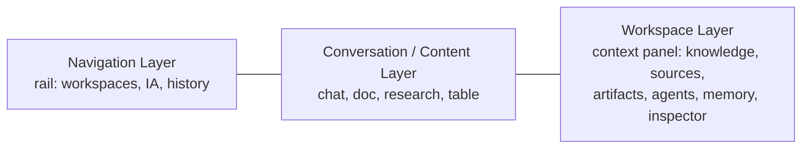
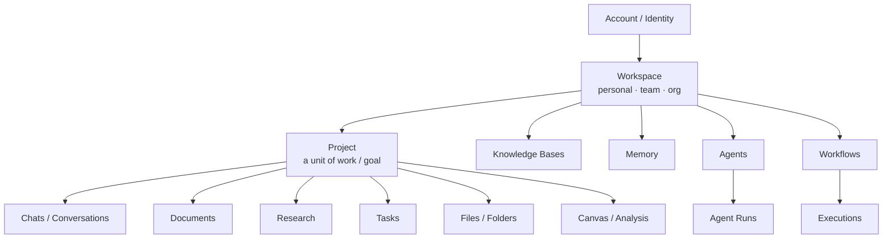
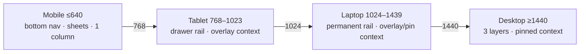
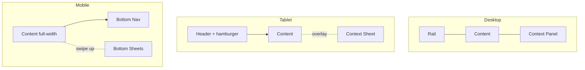

# Design Document: Auxify AI Workspace

> The complete product + visual design system for **Auxify AI** — an AI-native
> workspace that unifies conversation, knowledge, memory, execution,
> collaboration, agents, workflows, files, research, and productivity into a
> single, calm, premium experience.
>
> This document is organized in two layers, as requested:
>
> - **Part A — High-Level Design**: product philosophy, color, type, spacing,
>   information architecture, layout/responsive strategy, the conversation and
>   composer experiences, the AI experience model, workspace modes, search,
>   command center, microinteractions, accessibility, performance, empty states,
>   and onboarding.
> - **Part B — Low-Level Design**: concrete design tokens and the recommended
>   implementation approach for Next.js 15 / React 19, the enterprise component
>   system specs, the component folder structure, and supporting diagrams.
>
> Code examples use **TypeScript / React** because the target app (`@auxify/web`)
> is Next.js 15.1.4 + React 19 + TypeScript 5.7. Diagrams use Mermaid.

---

## Overview

Auxify AI is an **AI-native workspace** — an "AI operating system" that unifies
conversation, knowledge, memory, agents, workflows, research, files, tasks, and
documents into a single calm, premium, mobile-first surface. It is explicitly
**not** a chatbot, a ChatGPT clone, or a SaaS dashboard.

This document is the production-ready UX/UI specification for that product,
organized as:

- **Part A — High-Level Design:** philosophy, color/type/spacing systems,
  information architecture, layout & responsive strategy, the conversation and
  composer experiences, the AI experience model, workspace modes, search, the
  command center, microinteractions, accessibility, performance, empty states,
  and onboarding.
- **Part B — Low-Level Design:** implementation architecture, concrete design
  tokens, the enterprise component system (with TypeScript interfaces), the IA
  data models, the component folder structure, error handling, and testing.

**Guiding outcome:** a person understands Auxify in the first 30 seconds and
trusts it on day 300. Every decision traces back to one of five principles
(A1): reduce cognitive load, clarity over decoration, intentional interactions,
trust through transparency, and timelessness. The design **evolves the existing
app** (`apps/web`) — keeping the running `globals.css` token names and the
`ACCESSIBILITY.md` WCAG approach working — rather than restarting it.

---

## 0. Context & Grounding

This design is written for the existing monorepo at `/Users/aryanchauhan/ourai`,
frontend app `apps/web`.

**What already exists (and we build on, not against):**

- A real, working design system lives in `apps/web/src/app/globals.css`. It
  already defines CSS-variable tokens (`--s1..--s8` spacing, `--r-sm..--r-full`
  radii, `--blue/#014baa`, light + dark + `system` theme blocks via
  `data-theme`), an `Inter` type stack, a chat shell (`.ax`, `.ax__rail`,
  `.ax__main`), a premium Markdown renderer (`.cg__md`), citation chips, source
  cards, a composer, and menus.
- `apps/web/ACCESSIBILITY.md` documents a WCAG 2.1 AA *approach*: three
  responsive modes (desktop > 1024, tablet ≤ 1024, mobile ≤ 640), a keyboard
  model, ARIA/landmark structure, and a contrast audit. A `ThemeProvider` +
  pure `theme.ts` helpers manage light/dark/system.
- Components today are flat single files (`Markdown.tsx`, `CodeBlock.tsx`,
  `SourceCards.tsx`, `ResearchView.tsx`, `KnowledgePanel.tsx`, etc.) plus
  `components/shell/` and `components/brand/`.

**Design decision — evolve, don't restart.** Auxify already ships a credible
"chat" surface. The job of this design is to **promote that chat surface into a
full AI workspace** while keeping the existing token names working (so we never
break the running app), then layer a formal, documented design system on top.
Every new token below is additive and backwards-compatible with the current
`globals.css` variable names.

**Brand reconciliation (important).** Two blues are in play: the codebase uses
Auxify Blue `#014BAA`; the logo as described is a brighter royal-cobalt
`~#1652D9`. These are close in hue but different in luminance. We resolve this
by defining **one continuous blue scale** (`--blue-50 … --blue-950`) where:

- `#1652D9` (royal-cobalt) is the **brand / identity** blue — logo, marketing,
  the "spark" of the product. It maps to `--blue-500`.
- `#014BAA` (deep editorial) is the **primary action** blue in light mode —
  it has higher contrast on white (better for buttons/links/AA). It maps to
  `--blue-700`.

So the logo stays vivid, and interactive controls stay accessible, both drawn
from the same family. Details in Part B §B1.

---

# PART A — HIGH-LEVEL DESIGN

## A1. Product Philosophy & Design Principles

Auxify is an **AI operating system**, not a chatbot. The interface's job is to
make a vast set of capabilities (chat, knowledge, memory, agents, workflows,
research, files, tasks, documents) feel like *one calm surface* a person
understands in the first 30 seconds and trusts on day 300.

The reference quality bar is **Apple, Linear, Stripe, Notion, Arc, Vercel,
Figma** — software that feels engineered, restrained, and quietly powerful. We
explicitly reject the visual language of typical AI products: neon, crypto
gradients, "magic sparkle" overuse, gimmicky motion, heavy glassmorphism, and
dense dashboards.

### The five principles (every decision in this doc traces back to one)

1. **Reduce cognitive load.** The UI shows the *minimum* needed for the current
   intent and reveals the rest on demand (progressive disclosure). One primary
   action per view. Defaults are smart so most users never touch settings.

2. **Clarity over decoration.** Hierarchy comes from type scale, spacing, and a
   single accent — not borders, shadows, or color everywhere. Color is a tool
   for meaning (action, status, AI), never ornament. We use one accent; if
   everything is highlighted, nothing is.

3. **Intentional interactions.** Motion is feedback, not flourish. Every
   animation answers "what changed and where did it go?" in ≤ 200ms with a
   single easing curve. Reduced-motion users get instant state changes.

4. **Trust through transparency.** Because this is an AI workspace, the UI must
   always answer: *what does the AI know, what is it using, why, and how
   confident is it?* AI output is visibly attributed, sourced, and reversible.
   The user is always in control; AI proposes, the user disposes.

5. **Timeless, not trendy.** Neutral surfaces, editorial type, generous space,
   one confident blue. The design should look correct in 2026 and in 2031. We
   prefer structural elegance over effects that date quickly.

### Personality, expressed concretely

| Trait | How it shows up in pixels |
| --- | --- |
| Calm | Low-saturation neutral surfaces; lots of negative space; muted dividers; motion ≤ 200ms |
| Intelligent | Tight type tracking, tabular numerals for data, precise alignment to an 8px grid |
| Premium | Hairline borders, soft layered shadows, true-black/true-white restraint, no cheap gradients |
| Confident | One accent blue, big clear primary actions, no nervous micro-borders |
| Trustworthy | Visible sources, confidence/reasoning indicators, undo everywhere, no dark patterns |
| Efficient | Keyboard-first, command palette, optimistic UI, skeletons over spinners |
| Professional | Enterprise IA (workspaces/roles), consistent components, predictable behavior |
| Timeless | Neutral palette, editorial type, structural (not decorative) styling |

### Mobile-first as a philosophy, not a port

We design the smallest, most constrained surface first (one thumb, 320px,
intermittent network) and treat larger screens as *progressive enhancement*
that adds peripheral context (rails, panels) — never as the "real" design that
gets shrunk down. This forces ruthless prioritization that benefits every
breakpoint.

---

## A2. Color System

### A2.1 Strategy

A **neutral-dominant** palette: ~90% of the UI is neutral surface + text, with a
single **blue accent** for action and a small set of **semantic** colors for
status. This is what makes Linear/Stripe/Vercel feel premium — color is scarce
and therefore meaningful.

We define **scales** (50→950), not single values, so hover/active/disabled/soft
states are principled rather than ad-hoc, and so light and dark modes can pick
different stops from the *same* hue family.

### A2.2 Brand blue scale (derived from the logo's royal-cobalt)

| Token | Hex | Role |
| --- | --- | --- |
| `--blue-50` | `#EEF3FD` | soft accent background (light) |
| `--blue-100` | `#D8E4FB` | subtle fill, selected row (light) |
| `--blue-200` | `#B3C8F6` | borders on accent surfaces |
| `--blue-300` | `#7FA2EF` | dark-mode soft text on accent |
| `--blue-400` | `#4A80E8` | dark-mode accent (passes AA on dark bg) |
| `--blue-500` | `#1652D9` | **brand / logo** royal-cobalt |
| `--blue-600` | `#0F49C4` | accent hover (brand) |
| `--blue-700` | `#014BAA` | **primary action** (light) — existing `--blue` |
| `--blue-800` | `#013C87` | pressed / active |
| `--blue-900` | `#022E63` | deep ink, headings on accent |
| `--blue-950` | `#011B3D` | darkest, decorative |

Rationale: the logo reads vivid (`-500`), but interactive elements on white use
`-700` (`#014BAA`) which clears WCAG AA comfortably (see A2.6). On dark
surfaces, `-400` is the accent because deep blue on near-black fails contrast.

### A2.3 Neutral scale (surfaces, text, borders)

Slightly **blue-tinted neutrals** (a hint of the brand hue mixed into gray) so
the whole product feels cohesive rather than clinical gray. Matches the existing
`#0d1b2e` text / `#f7f9fc` rail tones.

| Token | Light | Dark |
| --- | --- | --- |
| `--neutral-0` | `#FFFFFF` | `#0B0F17` |
| `--neutral-50` | `#F7F9FC` | `#0D121C` |
| `--neutral-100` | `#F1F4F9` | `#121826` |
| `--neutral-200` | `#E8EDF4` | `#1A2233` |
| `--neutral-300` | `#E3E8F0` | `#222D42` |
| `--neutral-400` | `#CDD6E4` | `#33415C` |
| `--neutral-500` | `#9AA6BC` | `#4A566B` |
| `--neutral-600` | `#76829A` | `#76829A` |
| `--neutral-700` | `#4A566B` | `#AAB6CB` |
| `--neutral-800` | `#2A3447` | `#D6DEEC` |
| `--neutral-900` | `#0D1B2E` | `#EEF3FB` |

### A2.4 Semantic colors

One stop per state for light, one for dark. Each has a `-soft` background
companion for badges/alerts.

| Meaning | Light fg | Light soft bg | Dark fg | Dark soft bg |
| --- | --- | --- | --- | --- |
| Success | `#157347` | `#E5F4EC` | `#46C586` | `#10241B` |
| Warning | `#8A5E00` | `#FBF3E2` | `#E0A93B` | `#241B0E` |
| Danger | `#C02626` | `#FDEAEA` | `#F87171` | `#2A1618` |
| Info | `#014BAA` | `#E8F0FC` | `#4A8EEF` | `#14233C` |
| AI / agent | `#6D4AED` | `#EFEBFD` | `#A78BFA` | `#1C1633` |

**Note on the AI accent.** A restrained violet (`#6D4AED`) distinguishes
*AI-generated / agentic* surfaces from *user action* (blue). This is the single
permitted second hue, used only for AI provenance (reasoning, suggestions,
agent activity) so users can always tell "Auxify did this" from "I did this." It
must never be used decoratively. Warning value was chosen to match the existing
audited `--warning` `#8A5E00`.

### A2.5 Semantic token mapping (role tokens, not raw colors)

Components reference **role tokens**, never raw scale values. This is the
backwards-compatible bridge to the existing `globals.css` names.

| Role token | Light | Dark | Existing alias |
| --- | --- | --- | --- |
| `--bg` | `--neutral-0` | `--neutral-0` (dark) | ✓ exists |
| `--bg-rail` | `--neutral-50` | `--neutral-50` (dark) | ✓ |
| `--surface` | `#FFFFFF` | `#121826` | ✓ |
| `--surface-2` | `--neutral-100` | `--neutral-200` | ✓ |
| `--surface-3` | `--neutral-200` | `--neutral-300` | ✓ |
| `--hover` | `#EEF2F8` | `#1C2536` | ✓ |
| `--border` | `--neutral-300` | `#232D40` | ✓ |
| `--border-2` (control edge) | `#838A96` | `#6A7283` | ✓ (audited) |
| `--text` | `--neutral-900` | `#EEF3FB` | ✓ |
| `--text-2` | `#4A566B` | `#AAB6CB` | ✓ |
| `--text-3` | `#636C7B`* | `#7886A0` | ✓ (audited) |
| `--accent` | `#014BAA` | `#4A8EEF` | ✓ |
| `--accent-hover` | `#0F49C4` | `#6AA3F4` | ✓ |
| `--accent-contrast` | `#FFFFFF` | `#06101F` | ✓ |
| `--accent-soft` | `#E8F0FC` | `#14233C` | ✓ |
| `--ring` (focus) | `rgba(1,75,170,.16)` | `rgba(74,142,239,.22)` | ✓ |

\* `--text-3` light is set to the audited `#636C7B` (4.95:1 on `--bg`) rather
than a lighter gray, per `ACCESSIBILITY.md`.

### A2.6 Interaction states (defined once, applied everywhere)

For any interactive surface, derive states from its base using fixed rules:

- **Hover:** move one neutral step up (e.g. `--surface` → `--hover`), or accent
  → `--accent-hover`. Lightness delta ≈ 4–6%.
- **Active/pressed:** one more step + `transform: translateY(1px)` removed
  (no lift) or `scale(.99)`; accent → `--blue-800`.
- **Focus-visible:** `2px solid var(--accent)` outline, `2px` offset, plus a
  `4px` `--ring` glow on inputs. Never remove focus outlines.
- **Selected:** `--accent-soft` background + `--text` foreground + left accent
  marker for list rows.
- **Disabled:** `opacity: .4` + `cursor: not-allowed`, no hover response. Never
  rely on color alone — also reduce contrast and remove affordance.

### A2.7 Contrast — exceeding WCAG AA

Target: **AA for everything, AAA for body text where feasible.**

| Pair | Ratio | Bar |
| --- | --- | --- |
| `--text` `#0D1B2E` on `--bg` `#FFF` (light) | ~15.8:1 | AAA |
| `--text` `#EEF3FB` on `--bg` `#0B0F17` (dark) | ~15.3:1 | AAA |
| `--text-2` `#4A566B` on white | ~7.4:1 | AAA |
| `--text-3` `#636C7B` on white | ~4.95:1 | AA (audited) |
| `--accent` `#014BAA` on white | ~7.6:1 | AAA (large+small) |
| white on `--accent` `#014BAA` (button) | ~7.6:1 | AAA |
| `--accent` dark `#4A8EEF` on `#0B0F17` | ~5.9:1 | AA+ |
| focus ring / control edge `--border-2` | ≥ 3:1 | AA non-text |

Process: every new token is run through the same relative-luminance formula the
team already used (documented in `ACCESSIBILITY.md`); any pair under target is
nudged darker/lighter until it clears. Status colors are **never** the sole
signal — they always pair with an icon + text label (color-blind safe).

---

## A3. Typography System

### A3.1 Typefaces

- **UI + body:** `Inter` (already in the codebase) — variable font, excellent
  legibility, neutral and timeless. Loaded via `next/font` for zero layout
  shift and self-hosting (privacy + performance).
- **Display (optional, large headings/marketing):** Inter Display (or Inter
  with tighter tracking) — we avoid a second brand face to stay timeless; a
  separate display face is a future option, not a dependency.
- **Monospace (code, IDs, numbers):** the existing `--mono` stack
  (`ui-monospace, SFMono-Regular, "SF Mono", Menlo, Consolas`).

We deliberately use **one family** for UI to reduce cognitive load and keep the
product feeling engineered rather than decorated.

### A3.2 Type scale (modular, ~1.2 minor-third, snapped to the 4px grid)

| Token | Size / line-height | Weight | Tracking | Use |
| --- | --- | --- | --- | --- |
| `--fs-display` | 40 / 44 | 700 | -0.03em | Hero, welcome, empty-state titles |
| `--fs-h1` | 30 / 36 | 700 | -0.025em | Page titles |
| `--fs-h2` | 24 / 30 | 700 | -0.02em | Section headings |
| `--fs-h3` | 20 / 28 | 650 | -0.015em | Subsection / card titles |
| `--fs-h4` | 17 / 24 | 600 | -0.01em | Group labels |
| `--fs-subhead` | 16 / 24 | 600 | -0.01em | Subheadings, list headers |
| `--fs-body-lg` | 16 / 26 | 400 | 0 | **AI responses, long reading** |
| `--fs-body` | 15 / 24 | 400 | 0 | Default UI body |
| `--fs-body-sm` | 14 / 20 | 400 | 0 | Secondary text, dense lists |
| `--fs-caption` | 13 / 18 | 500 | 0 | Captions, helper text |
| `--fs-label` | 12 / 16 | 600 | 0.01em | Field labels, chips |
| `--fs-meta` | 11 / 14 | 600 | 0.04em UPPER | Metadata, eyebrows, stats |
| `--fs-code` | 13.5 / 21 | 400 mono | 0 | Code blocks |

Weights map to Inter axes: 400 (regular), 500 (medium), 600 (semibold), 650/700
(bold). We avoid 300/light (poor on low-DPI) and 800+ except the wordmark.

### A3.3 Reading optimization for long AI responses & research

This is a workspace where people *read a lot* (AI answers, research, docs).
Reading ergonomics get first-class treatment:

- **Measure (line length):** body content is capped at **`--thread-max: 68ch`**
  (~720–760px), the existing `--thread-max` value, which lands in the
  research-backed 50–75 character range for sustained reading.
- **Body size:** AI responses render at `--fs-body-lg` (16/26) — slightly larger
  and looser than chrome UI (15/24) because answers are read, not scanned. This
  matches the existing `.cg__md` at 15.5/1.75.
- **Vertical rhythm:** paragraph spacing = `--s4` (16px); heading top margin =
  `--s5` (24px) — a consistent rhythm so long answers have visible structure.
- **Hanging structure:** H2s get a 4px accent bar (already in `.cg__md h2`),
  list markers are accent-colored, blockquotes get a left rule + soft tint.
- **Numerals:** `font-variant-numeric: tabular-nums` for any data/stats/tables
  so columns align (already used on `.ax__stat`).
- **Code:** inline code in accent on soft surface; blocks on `--surface-3` with
  language label + copy affordance.
- **Long-form documents (Document mode):** an even wider but still bounded
  measure (`--doc-max: 76ch`) with a document-style heading hierarchy and a
  generated outline rail.

### A3.4 Responsive type

Type scales *down* gently on mobile to protect measure and rhythm. Using
`clamp()` so it's fluid between breakpoints rather than stepping:

```css
--fs-display: clamp(28px, 6vw + 8px, 40px);
--fs-h1:      clamp(24px, 4vw + 8px, 30px);
--fs-h2:      clamp(20px, 3vw + 6px, 24px);
/* body sizes stay fixed (15/16px) — never shrink reading text below 15px */
```

Body and AI-response text **never** drop below 15px (16px for the answer body)
on any breakpoint — readability is non-negotiable. Only display/headings scale.

---

## A4. Spacing & Layout Foundations

### A4.1 Base grid

A strict **4px base unit**, with 8px as the primary rhythm — matching the
existing `--s1: 4px … --s8: 48px`. All padding, margins, gaps, and component
dimensions are multiples of 4.

| Token | px | Typical use |
| --- | --- | --- |
| `--s1` | 4 | icon gaps, tight chip padding |
| `--s2` | 8 | control inner gaps, chip padding |
| `--s3` | 12 | input padding, list row padding |
| `--s4` | 16 | card padding, paragraph rhythm |
| `--s5` | 24 | section padding, container gutter |
| `--s6` | 32 | block separation |
| `--s8` | 48 | major section separation |
| `--s10` | 64 | (new) hero / page top spacing |
| `--s12` | 96 | (new) marketing-scale spacing |

### A4.2 Layout containers

| Container | Max width | Use |
| --- | --- | --- |
| `--thread-max` | 760px (68ch) | conversation column, reading |
| `--doc-max` | 820px (76ch) | document editor body |
| `--content-max` | 1200px | settings, list/table pages |
| `--wide-max` | 1440px | dashboards, multi-pane analysis |
| full-bleed | 100% | canvas, research board, tables |

Gutters: 16px mobile (`--s4`), 24px tablet (`--s5`), 32–48px desktop.

### A4.3 The three structural layers (desktop)

Auxify's desktop layout is **three layers**, which is the spine of the whole
product:



- **Navigation layer** (left, `--rail-w: 282px`): identity/workspace switcher,
  primary IA destinations, and contextual history (e.g. recent chats).
- **Conversation/Content layer** (center, flexible, capped by `--thread-max` or
  the active mode's container): the primary work surface.
- **Workspace layer** (right, collapsible ~`360px`): the *context* of the
  current work — sources, knowledge, artifacts, agent runs, memory, inspector,
  references. Collapsed by default on first run to keep things calm.

### A4.4 Component spacing rules

- **Density tiers:** `comfortable` (default) and `compact` (data-dense tables,
  power users) — a single `data-density` attribute scales row paddings.
- **Touch targets:** ≥ 44×44px on mobile (tools today are 36px → bumped to 44
  on coarse pointers via `@media (pointer: coarse)`).
- **Section spacing:** related items `--s3/--s4`; distinct groups `--s6`; page
  sections `--s8`.

---

## A5. Information Architecture

### A5.1 The core problem

Auxify has *many* concepts: Projects, Workspaces, Chats, Folders, Knowledge
Bases, Memory, Agents, Files, Research, Tasks, Workflows, Documents, Settings.
If all of these are top-level, the product feels like a SaaS dashboard (which we
reject). The IA principle: **one home for "doing," a small set of "places," and
everything else is contextual to the work.**

### A5.2 The mental model: Workspace › Project › Object



- **Workspace** = the top container and the unit of *collaboration & billing*.
  Personal workspace by default; teams/orgs add members, roles, shared
  knowledge. Switching workspace changes everything below it.
- **Project** = a goal-scoped container ("Q3 Launch", "Customer X", "Thesis").
  It bundles the conversations, documents, research, tasks, and files for one
  effort. This is the key idea that makes Auxify feel organized rather than an
  endless chat list.
- **Objects** = Chats, Documents, Research, Tasks, Files, Canvases — the things
  you create *inside* a project.
- **Cross-cutting capabilities** = Knowledge Bases, Memory, Agents, Workflows —
  these live at the workspace level and are *referenced into* projects/chats
  (e.g. "use this knowledge base in this chat").

### A5.3 Primary navigation destinations (kept deliberately small)

The left rail / bottom nav exposes only a handful of destinations; everything
else is reached contextually or via the Command Center (A11):

1. **Home / Ask** — the default surface: start a conversation, resume work,
   smart suggestions. (The "new chat" experience, elevated.)
2. **Projects** — browse/enter projects; each project is a hub.
3. **Library** — Knowledge Bases, Files, Documents, Research outputs (the
   "things you've made and gathered").
4. **Agents & Workflows** — configure and monitor automation.
5. **Search** — universal search across everything (also `/` and ⌘K).

Plus persistent: **workspace switcher**, **Memory** (as an inspectable panel,
not a page you "visit" often), **Settings**, **profile/notifications**.

### A5.4 Scaling: individual → team → enterprise

The IA is the *same shape* at every scale; capabilities light up progressively:

| Concept | Individual | Team | Enterprise |
| --- | --- | --- | --- |
| Workspace | 1 personal | shared team workspace(s) | multiple orgs, SSO, domains |
| Members / roles | just me | Owner/Admin/Member/Guest | + custom roles, SCIM, groups |
| Knowledge | personal KBs | shared + personal KBs | governed KBs, retention, DLP |
| Memory | personal memory | personal + (opt-in) shared facts | governed, audited memory |
| Agents/Workflows | personal | shared templates | approval flows, audit logs |
| Sharing | links | workspace + link + permissions | granular ACL, expiry, watermark |
| Admin | none | workspace settings | admin console, usage, billing seats |

UI consequence: an **admin console** (already hinted by `AdminPanel.tsx`)
appears only for Owner/Admin roles; guests see a deliberately reduced surface.
Role is reflected in the workspace switcher and gates destinations — never
shown as broken/disabled clutter to users who lack access (hide, don't taunt).

### A5.5 IA → URL structure (Next.js App Router)

```
/                         → Home / Ask
/p/[project]              → Project hub
/p/[project]/c/[chat]     → Conversation
/p/[project]/doc/[id]     → Document
/p/[project]/research/[id]→ Research workspace
/library                  → Knowledge / Files / Docs
/library/kb/[id]          → Knowledge base
/agents · /agents/[id]    → Agents
/workflows · /workflows/[id]
/search?q=                → Universal search
/settings/*               → Settings (account, workspace, members, billing)
/admin/*                  → Admin console (role-gated)
```

Workspace is encoded in a layout segment / subdomain (enterprise), not in every
path, so switching workspace is a context change, not a navigation.

---

## A6. Layout System & Responsive Strategy

### A6.1 Breakpoints and what changes at each

We design mobile-first; these are `min-width` enhancement points. The existing
app uses 640/1024 as the major shifts; we add finer device anchors for QA.

| Token | Width | Class of device | Layout behavior |
| --- | --- | --- | --- |
| `xs` | 320 | small phones | single column, bottom nav, 1-handed |
| `sm` | 375–414 | typical phones | single column, larger tap targets, sheets |
| `md` | 768 | tablet portrait | hybrid: collapsible drawer rail + overlay context |
| `lg` | 1024 | tablet landscape / small laptop | rail becomes permanent; context still overlay |
| `xl` | 1440 | desktop | full 3-layer; context panel can pin open |
| `2xl` | 1920+ | large desktop | 3-layer + wider content max, optional 4th inspector |



### A6.2 Desktop (≥1024, full at ≥1440): three layers

As in A4.3. The center column is capped to the active mode's container and
centered; the rail is `282px`; the context panel is `~360px` and can be pinned
(≥1440) or overlaid (1024–1439). Keyboard users can toggle each layer
(`⌘\` rail, `⌘.` context). This matches and extends the existing `.ax` grid
(`grid-template-columns: var(--rail-w) minmax(0,1fr)`).

### A6.3 Tablet (768–1023): adaptive hybrid

- Rail becomes an **off-canvas drawer** behind a header hamburger
  (`aria-expanded`/`aria-controls`, focus moves in, Escape closes) — already
  implemented per `ACCESSIBILITY.md`.
- Context/workspace layer becomes a **right overlay sheet** (`role="dialog"`,
  `aria-modal`, scrim, Escape).
- Center column gets the full width; reading max still applies so text never
  sprawls.
- This is the "in-between" state: enough room for a real content column, not
  enough for three permanent columns, so peripheral layers become summonable.

### A6.4 Mobile (≤640): bottom nav, sheets, thumb-first

The defining surface. Principles:

- **Bottom navigation bar** (`<nav aria-label="Primary">`, fixed, safe-area
  inset) with the top ~4 destinations + a center **Ask** action. This is reachable
  by the thumb; the existing `BottomNav.tsx` already does this.
- **Context as sheets:** the rail and context panel become **bottom sheets**
  that slide up — sources, knowledge, attachments, model picker, memory all open
  as draggable sheets with a grabber, dismissible by swipe-down or scrim tap.
- **Progressive disclosure:** the composer shows only text + send + one "+"
  that expands tools in a sheet; advanced controls are one tap away, not on
  screen.
- **Thumb-first / one-handed:** primary actions sit in the bottom third; the top
  bar is for title + back only. Destructive actions are never top-right where a
  thumb stretches.
- **Single column, full width** with `--s4` gutters; content reflows, never
  truncates horizontally (tables scroll within a card).

### A6.5 Behavior *between* breakpoints (the hard part)

We specify transitions explicitly so nothing "jumps":

- **640 → 768:** bottom nav fades out; a hamburger appears top-left and the
  drawer rail becomes available. The center column keeps its measure; gutters
  grow 16→24px. Sheets that were bottom-anchored become right-anchored.
- **1023 → 1024:** the drawer rail "promotes" to a permanent column; any open
  drawer is force-closed (the `sidebarReducer` already does this so it can't get
  stuck open). The context panel stays an overlay.
- **1439 → 1440:** the context panel gains a **pin** affordance; if previously
  pinned (persisted preference), it occupies a permanent third column and the
  center re-centers within the remaining space.
- **State persistence:** rail/context open + pin states persist per device class
  (so your phone and desktop remember independently).
- **No content loss:** resizing never hides content the user was reading; a
  panel that closes returns its content to an accessible affordance (a button
  in the top bar / a bottom-nav entry).

### A6.6 Region map (responsive)



---

## A7. Chat / Conversation Experience

The conversation is Auxify's beating heart, but it is framed as **thinking
space**, not a messaging app. We avoid the "two-color speech bubble" cliché that
makes products feel like a toy chat.

### A7.1 Message anatomy

- **User turns** are quiet: right-aligned isn't used (it wastes the reading
  measure); instead user messages sit in a soft `--user-bubble` block, left
  aligned, full measure, with a small "You" + timestamp eyebrow on hover. This
  keeps the eye on a single reading column.
- **Assistant turns** have *no bubble at all*. They render as clean editorial
  content (`.cg__md`) on the page background, with a small Auxify mark + model
  chip above. Removing the bubble is deliberate: it signals "this is a document
  you can read and act on," not "a text from a friend." This is the single
  biggest differentiator from ChatGPT-style UIs.
- **Turn affordances** appear on hover (desktop) or via a `⋯` tap (mobile):
  copy, regenerate, edit (user), branch, share, save-to-doc, give feedback.
  These never clutter the resting state.

### A7.2 Streaming responses

- Tokens stream into the same editorial layout with a **soft caret** (a 2px
  accent block) at the write head. No bouncing dots inside the answer.
- A **reasoning strip** (collapsible, AI-violet) can appear *above* the answer
  while the model thinks ("Searching knowledge base… Reading 4 sources…
  Drafting"), then collapses to a one-line "Used 4 sources · 3 tools" summary
  when done (see A9).
- **Stop / pause** is always present during generation as the primary composer
  action (the send button morphs to stop). Partial output is kept, never
  discarded.
- Streaming is **interruptible and steerable**: the user can type a correction
  ("shorter, in a table") that queues and applies to the continuation.

### A7.3 Rich content within answers

| Content | Treatment |
| --- | --- |
| **Code blocks** | `CodeBlock.tsx` — language label, copy button, soft-wrap toggle, line numbers on demand; horizontal scroll within a bordered card; "open in Coding workspace" action |
| **Tables** | tabular-nums, sticky header, horizontal scroll inside a card on mobile, "expand" to full-screen sheet, export to CSV |
| **Images / diagrams** | rounded, bordered, click to lightbox; generated images get an AI-violet provenance chip |
| **References / citations** | inline superscript chips `[1]` that scroll-link to a Sources list; hover/long-press shows a source preview card (`SourceCards.tsx`) |
| **Math** | KaTeX, accent-tinted block delimiters |
| **Attachments** | file pills with type icon, size, and a preview affordance |
| **Artifacts** | substantial outputs (a doc, a chart, an app) lift out of the thread into the **Workspace layer** as an *artifact* (`ArtifactsPanel.tsx` / `VisualArtifact.tsx`) with its own versioned surface |

### A7.4 Actions & follow-ups

- **Inline actions** on an answer: turn into document, create task, add to
  knowledge base, run as workflow, share. These convert "a chat said X" into
  "Auxify did X" — the bridge from conversation to execution.
- **Follow-up suggestions** render as up to 3 quiet chips beneath the answer
  (dismissible, never modal). They are *suggestions*, styled secondary, so they
  guide without nagging.

### A7.5 Long-conversation navigation

Long threads are a known pain point. Auxify solves it structurally:

- **Conversation outline:** a right-side mini-map / outline (in the context
  layer) lists each turn by its auto-title; click to jump. On mobile it's a
  "jump to" sheet from the title bar.
- **Sticky context header:** the current topic/section title stays pinned at the
  top of the thread as you scroll.
- **Branching:** editing a user turn or "exploring an alternative" forks the
  thread into a branch with a visible switcher (so context is never destroyed,
  only versioned).
- **Scroll management:** new tokens autoscroll only if the user is at the bottom;
  a "↓ N new" pill appears if they've scrolled up. Jump-to-latest is one tap.
- **Summarize older context:** very long threads get an AI "context so far"
  recap card the user can expand, keeping the working set small.

---

## A8. Prompt Composer

The composer must feel as simple as a single text field yet expose text, voice,
files, images, knowledge, agents, tools, research, and memory.

### A8.1 Structure

```
┌─────────────────────────────────────────────┐
│  [context chips: KB · Agent · 2 files]        │  ← only when active
│                                               │
│  Ask anything, or describe a task…            │  ← growing textarea
│                                               │
│  [＋]  [🎙]            model ▾        [↑ Send] │  ← action row
└─────────────────────────────────────────────┘
```

- **One field, progressive power.** Resting state is a calm rounded field with a
  placeholder, a `+` (attach/tools), a mic, a model selector, and send. Nothing
  else competes.
- **Context chips** appear *above* the field only when something is attached
  (a knowledge base, an agent, files, a memory scope). Each chip is removable
  and shows exactly what the AI will use — core to transparency (A9).
- **The `+` menu** opens a sheet/menu: Upload file, Add image, Attach knowledge
  base, Use agent, Enable tools (web search, code, research), Scope memory. On
  desktop it's a popover; on mobile a bottom sheet with big touch rows.

### A8.2 Modalities

- **Text:** auto-grow to ~8 lines then scroll; `Enter` sends, `Shift+Enter`
  newline (configurable); `/` opens slash-commands (insert prompt, switch
  workspace mode, call agent); `@` mentions knowledge/agents/projects/people.
- **Voice:** tap mic → live waveform + interim transcript; supports
  "hold-to-talk" (mobile, one-handed) and "tap-to-toggle." A voice **answer**
  mode reads responses aloud (opt-in). Transcription is editable before send.
- **Files / images:** drag-drop (desktop), `+` (everywhere), paste; show upload
  progress inline (A12); previews as pills; images can be annotated.
- **Knowledge / memory / agents / tools / research:** attached as chips; the
  active set is always visible so the user knows the AI's "working context."

### A8.3 Mobile vs desktop behavior

- **Mobile:** composer is docked above the bottom nav, within thumb reach. The
  field starts single-line; focusing expands it and temporarily hides the bottom
  nav to maximize space (restored on blur). `+` and mic flank the field; send is
  bottom-right (primary thumb zone). All secondary tools live in sheets.
- **Desktop:** composer is centered under the thread (max `--thread-max`),
  supports full keyboard (slash/mention, ⌘↩ to send, drag-drop). Tools are
  popovers. The composer can **detach to a floating command** via ⌘K (A11).
- **Both:** the composer persists drafts per conversation; switching away and
  back restores the in-progress message and attachments.

---

## A9. AI Experience Model (Trust & Transparency)

AI is woven through every surface, not bolted on as a "chat tab." The unifying
rule: **AI proposes, the user disposes**, and the UI always answers *what the AI
knows, what it's using, why, and how confident it is.*

### A9.1 The four transparency questions, answered in-product

| Question | UI mechanism |
| --- | --- |
| **What does it know?** | Memory panel (inspectable, editable facts); attached-context chips on the composer; "Auxify knows" summary on the project hub |
| **What is it using?** | Live reasoning strip during generation; "Used N sources · M tools" summary chip after; expandable to the exact sources/queries/tools |
| **Why this answer?** | Inline citations linking claims → sources; a "Why?" affordance on any answer opens the reasoning + evidence trail |
| **How confident?** | Confidence indicator (see A9.3) on factual/agentic outputs; explicit "unverified" tags when no source backs a claim |

### A9.2 AI provenance language (the violet system)

Anything AI-generated or agentic carries the **AI-violet accent** (A2.4),
distinct from user-blue. Used for: the reasoning strip, AI suggestion chips,
memory items, agent run badges, and "AI wrote this" markers on documents. It is
the only place violet appears, so it reliably means "Auxify did this."

### A9.3 Reasoning & confidence indicators

- **Reasoning strip:** a collapsible, violet-tinted region showing live steps
  (plan → retrieve → tool → draft). Default collapsed for casual chat; default
  expanded in Research/Analysis modes. Honest: it reflects real steps, never
  theatrical "thinking…" for show.
- **Confidence:** a 3-level, *labeled* indicator — `High` / `Medium` / `Low /
  Unverified` — shown as a small pill with icon + text (never color alone).
  Confidence is derived from source coverage and model signals; low-confidence
  claims are visually de-emphasized and invite verification. We never fabricate
  precise percentages.
- **Citations:** every external claim links to a source; uncited claims in a
  sourced answer are flagged so users can tell synthesis from retrieval.

### A9.4 AI suggestions, summaries, recommendations

- **Suggestions** are always *secondary, dismissible, and contextual* (composer
  follow-ups, "summarize this thread," "create a task from this"). They never
  interrupt; they live at the edges.
- **Summaries** appear on long threads, projects ("project digest"), documents,
  and research bundles — each clearly labeled AI-generated with a "regenerate"
  and "edit" affordance.
- **Recommendations** (next actions, relevant knowledge, suggested agents)
  surface on the Home/Ask surface and project hubs, ranked and explainable
  ("because you …").

### A9.5 AI actions, automation, agents

- **Actions** are reversible by default and show a confirmation for anything
  destructive or external (sending email, writing to a system). A persistent
  **activity feed** logs every AI action with undo where possible.
- **Agents** are configurable AI workers with a name, instructions, tools,
  knowledge, and permissions. Their runs appear in the Workspace layer with
  live step output, pausable, with a clear "needs your approval" state for
  gated steps.
- **Automation / workflows** chain steps (triggers → actions) with a visual
  run timeline (A-Components: Timeline). Every automated run is auditable.

### A9.6 Control & reversibility

Undo is a first-class, global affordance (toast with Undo on every mutating
action; ⌘Z where applicable). Nothing the AI does is hidden or irreversible
without an explicit, clearly-worded confirm.

---

## A10. Workspace Modes

A **workspace mode** retunes the same three-layer shell for a class of work. The
chat, composer, and AI model stay constant; what changes is the *content layer's
primary surface*, the *default tools/agents*, and the *context panel contents*.
Modes are a lens, not a different app — this preserves the user's mental model
(a core requirement).

### A10.1 Switching modes

- A **mode switcher** sits in the content header (segmented control on desktop,
  a labeled dropdown / sheet on mobile). Switching is instant and non-destructive
  (the conversation persists; the surrounding tools adapt).
- Modes can be set per project (a "Coding project" defaults to Coding mode) and
  overridden per conversation. AI can *suggest* a mode ("This looks like
  research — switch to Research mode?") but never forces it.

### A10.2 The modes

| Mode | Primary surface | Default tools / agents | Context panel | AI assist focus |
| --- | --- | --- | --- | --- |
| **Research** | Sources board + synthesized answer | Web search, deep-research agent, citation manager | Sources, citations, saved findings | Multi-step retrieval, source ranking, "what's missing" |
| **Writing** | Document editor (`--doc-max`) | Outline, tone, rewrite, cite | Outline, references, version history | Draft/expand/condense, voice consistency |
| **Coding** | Code panel + diff view | Repo context, run, test, terminal | Files, symbols, diffs, run output | Edit-with-diff, explain, fix, test |
| **Business** | Dashboard cards + chat | Data connectors, calc | KPIs, data sources | Summaries, forecasts, slide/brief drafts |
| **CRM** | Contact/deal records + chat | CRM connectors | Record details, activity, next steps | Draft outreach, summarize accounts, next-best-action |
| **Document** | Long-form reader/editor | Read, annotate, extract | Outline, annotations, sources | Summarize, Q&A over the doc, extract structure |
| **Marketing** | Asset board (copy + visuals) | Image gen, brand voice | Brand kit, assets, channels | Multi-variant copy, on-brand visuals |
| **Planning** | Tasks / timeline / kanban | Task agent, calendar | Tasks, milestones, owners | Break down goals, schedule, status digests |
| **Analysis** | Data table + charts canvas | Query, chart, stats | Datasets, transforms, chart specs | Query in natural language, explain results |

### A10.3 How AI assists per mode

The AI is *mode-aware*: it loads mode-appropriate tools and prompting so the
same question yields the right kind of output (a Research-mode answer is
sourced and structured; a Coding-mode answer is a diff). The active mode is
shown to the user (transparency) and is part of the context the AI reports
using.

---

## A11. Search & Command Center

### A11.1 Universal search

- **Scope:** Chats, Projects, Files, Knowledge, Memory, Agents, Documents,
  Tasks, Workflows — one index, one entry point.
- **Entry:** the rail Search item, `/` from anywhere not in a text field, and
  inside the Command Center (⌘K).
- **Experience:** instant (results stream as you type, debounced ~120ms),
  grouped by type with the strongest match surfaced first. Each result shows
  type icon, title, a matched-snippet with highlight, project context, and
  timestamp. Keyboard-navigable (↑/↓, Enter to open, ⌘Enter to open in panel).
- **Ranking logic (explained to users via subtle labels):** blends lexical match
  + semantic similarity + recency + your interaction history + current project
  context. Exact title matches always win; recent and in-current-project items
  get a boost; semantic matches fill the long tail. "Best match" / "Recent" /
  "In this project" group labels make ranking legible.
- **Filters & scopes:** type filters, project scope, date, owner; a scope chip
  ("in Project X") can be toggled. Empty query shows recents + suggested.

### A11.2 Command Center (⌘K)

A universal, keyboard-first command palette — the power-user spine.

- **Capabilities:** Navigate anywhere (go to project/chat/page), Search anything
  (falls through to universal search), Create anything (new chat/doc/project/
  task/agent), Trigger workflows, Invoke AI ("Ask Auxify…" inline), Manage files,
  Launch tools, Switch workspace/mode/theme.
- **Interaction pattern:** ⌘K opens a centered overlay; typing filters commands;
  a leading token routes intent (`>` commands, `@` people/agents, `#` projects,
  `/` files, plain text = search/ask). ↑/↓ navigate, Enter runs, Esc closes,
  Tab drills into a command's parameters. Recent + suggested commands show on
  open. Everything reachable here is reachable without the mouse.
- **Inline AI:** typing a natural-language request and hitting `⌘Enter` sends it
  straight to Auxify without leaving the keyboard — the palette becomes a
  "do anything" bar.
- **Mobile:** surfaced via a search affordance in the top bar and a Command
  action; opens as a full-height sheet with large rows and the same token
  routing, optimized for tap.

---

## A12. Microinteractions & Motion

Motion is **feedback, not decoration** (Principle 3). One easing curve
(`--t: 160ms cubic-bezier(.4,0,.2,1)`, already in the codebase) governs almost
everything; only large surface transitions go to ~200–240ms.

| Event | Motion | Purpose |
| --- | --- | --- |
| **Send message** | composer field collapses, user turn rises in with a 120ms fade+translateY(4px); send→stop morph | confirms capture, sets focus on the answer |
| **AI generating** | reasoning strip expands (height auto, 200ms); soft caret pulses at write head | shows liveness without spinners |
| **AI response done** | reasoning collapses to summary chip (200ms); action row fades in | signals completion + invites action |
| **File upload** | pill appears with determinate progress ring; success = ring→check (no bounce) | honest progress |
| **Task complete** | row checks with a 160ms check-draw + subtle strikethrough | satisfying, not gaudy |
| **Search** | results cross-fade as ranking updates; skeleton rows for first paint | perceived speed |
| **Navigation** | content layer cross-fades (120ms); rail selection marker slides | spatial continuity |
| **Workspace switch** | brief 200ms content cross-fade + context panel re-populate | "the room changed" |
| **Panel/sheet open** | slide from edge with scrim fade; mobile sheets are draggable | clear spatial origin |
| **State change (toggle, save)** | 100ms tint/position change + optional toast w/ Undo | immediate acknowledgement |

**Reduced motion:** with `prefers-reduced-motion`, all translate/scale/auto-height
animations become instant opacity changes or are removed; the soft caret stops
pulsing; nothing essential depends on motion.

---

## A13. Accessibility (meeting & exceeding WCAG 2.1 AA)

Builds on the audited approach in `apps/web/ACCESSIBILITY.md`.

- **Color & contrast:** all text ≥ AA, body ≥ AAA where feasible (A2.7);
  status never by color alone (always icon + label); a verified palette for
  protanopia/deuteranopia/tritanopia (semantic hues chosen for distinguishable
  luminance, not just hue).
- **Keyboard:** every action reachable without a mouse; visible `focus-visible`
  rings (A2.6); logical tab order; Command Center (A11) as a keyboard superpower;
  documented shortcuts with a `?` cheat-sheet; focus trapping in dialogs/sheets
  with restore-on-close; "skip to content" link.
- **Screen readers:** semantic landmarks (`<nav> <main> <aside>`), `aria-live`
  regions for streaming answers (polite) and toasts (assertive); meaningful
  labels on icon-only buttons; the conversation is a labeled `log`; streaming
  text is announced in coherent chunks, not per-token spam.
- **Reduced motion:** A12; honored globally via a single media query + a user
  setting that overrides it.
- **Large text / zoom:** layouts use `rem`/`ch` and reflow to 200% zoom and
  400% text scaling without loss of function; no fixed pixel heights on text
  containers; line-length caps prevent overflow.
- **Touch & motor:** ≥ 44×44px targets on coarse pointers; primary actions in
  the thumb zone; generous hit-slop; no hover-only actions on touch; swipe
  actions always have a tap equivalent; adjustable/disable-able auto-scroll.
- **Cognitive:** plain-language labels, consistent patterns, undo everywhere,
  no time-limited interactions, clear error recovery.
- **Forms & errors:** programmatic label association, `aria-describedby` for
  hints/errors, errors announced and never color-only.

Every component spec in Part B carries its own a11y contract.

---

## A14. Performance, Empty States & Onboarding

### A14.1 Performance design (perceived speed)

- **Optimistic UI:** user turns, sends, toggles, renames, task checks render
  instantly and reconcile on server confirm (rollback + toast on failure).
- **Streaming-first:** answers stream token-by-token; nothing waits for a full
  payload.
- **Skeletons over spinners:** lists, project hubs, and the thread show
  structural skeletons (shaped like the real content) for first paint; spinners
  only for indeterminate sub-second waits.
- **Caching & instant nav:** route-level prefetch (Next.js App Router), cached
  conversation/project data, stale-while-revalidate so revisits are instant.
- **Latency handling:** if a response is slow, the reasoning strip explains why
  ("searching 12 sources"); a graceful "still working" state after ~10s; never
  a frozen UI.
- **Offline resilience:** drafts persist locally; queued sends retry on
  reconnect; a calm, non-alarming offline banner; read access to cached content;
  clear per-item sync state.
- **Budgets:** target interaction-to-feedback < 100ms, first meaningful paint
  fast via skeletons, smooth 60fps motion (transform/opacity only).

### A14.2 Empty states (educate, guide, encourage)

No blank screens. Every empty state has: a one-line purpose, a primary action,
and 2–3 example starters.

| Surface | Empty state |
| --- | --- |
| **Home / Ask** | Warm greeting + role-aware example prompts + "resume where you left off" + create-project nudge |
| **Projects** | "Projects keep related work together" + Create project + a sample template |
| **A project** | Suggested first actions (start a chat, add knowledge, create a doc) tailored to the project's mode |
| **Knowledge base** | "Add files or connect a source so Auxify can use your knowledge" + drag-drop target |
| **Memory** | "Auxify remembers useful facts you approve" + how it works + privacy note |
| **Agents** | What an agent is + 3 starter templates + Create agent |
| **Search (no results)** | "No matches for X" + suggestions to broaden + create-from-query |
| **Tasks** | "Turn any answer into a task" + create + example |

### A14.3 Onboarding (frictionless, progressive)

- **First run:** a 3-step, skippable setup — (1) name/theme & light/dark, (2)
  what you'll use Auxify for (picks a default workspace mode + example prompts),
  (3) optionally connect knowledge. Then drops the user straight into a primed
  Home/Ask, *not* a tour modal maze.
- **Progressive disclosure:** advanced surfaces (agents, workflows, admin) are
  introduced contextually the first time they're relevant ("You can save this as
  a reusable agent"), with dismissible coach-marks (max one at a time).
- **Inline guidance:** empty states (A14.2) carry the teaching load; a `?`
  command opens shortcuts + docs; nothing blocks the user from doing real work
  immediately.
- **Team onboarding:** invited members land in the shared workspace with a
  "what's here" digest (shared knowledge, projects, agents) rather than a blank
  personal start.

---
